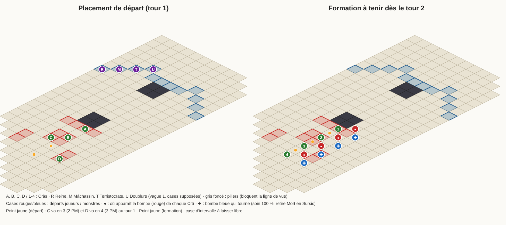

# Reine des Voleurs : modèle du combat et stratégie pour 4 Crâs multi-élément

Donjon 83 « Trône de la Cour Sombre », Reine 3726, 4 personnages. Synthèse du 2026-10-08.

> **⚠ Formation invalidée (2026-10-09).** Ce document suppose que la Bonbombe apparaît en ligne au nord-est du
> personnage. Le joueur a confirmé en jeu qu'elle apparaît **en haut**, sinon **en haut à droite**. Avec cette règle, la
> formation ci-dessous **ne tient plus** : ne pas l'utiliser. **La stratégie à jour est
> [`strategie-4-cras.md`](strategie-4-cras.md)** (formation F-A, scripts dans `tools/reine-des-voleurs/v2/`). Le reste
> du modèle (vagues, Bonbombes, Mort en Sursis, faiblesses des monstres) reste valable.

## Comment lire ce document

Chaque affirmation porte une étiquette qui dit d'où elle vient :

| Étiquette | Origine |
|---|---|
| **[D]** | Données du dépôt (DofusDB 3.6, extraites le 2026-10-04, donc avant la mise à jour 3.7 du 2026-10-06). |
| **[M]** | Mesuré dans le moteur du simulateur (src/engine), par micro-combats. |
| **[S]** | Mesuré avec le modèle des Bonbombes écrit pour cette synthèse (`tools/reine-des-voleurs/modele-bombes.ts`). Il est indépendant du moteur et suit les règles du jeu réel décrites au §1.4. |
| **[E]** | Source externe, avec son URL et sa date. Toutes ont été consultées le 2026-10-08. |
| **[R]** | Mon raisonnement : à vérifier. |

**SÛR** signifie que données, moteur et sources externes concordent, ou qu'au moins deux sources indépendantes le disent sans contradiction. **INCERTAIN** signifie qu'il y a contradiction, une seule source, ou une simple déduction.

---



## 0. En bref

- **Carte du combat :** 137101312 « Traversée ». C'est une passerelle diagonale de 12 cases de large avec deux piliers. Il n'y a qu'un seul combat, en 5 vagues.
- **Placement proposé :** les Crâs démarrent sur **354, 381, 380 et 451**.
  - Au tour 1, le Crâ de 380 va en **408** (2 PM) et celui de 451 en **435** (3 PM).
  - Ensuite, la colonne **354 – 381 – 408 – 435** ne bouge plus. C'est une case sur deux, en diagonale écran vers le bas-gauche depuis le pilier rouge.
  - Dans le modèle du jeu réel, c'est **sans aucune mort par bombe pendant 30 tours, quel que soit l'ordre d'initiative des 4 Crâs** (24 ordres sur 24) [S].
  - La formation fabrique elle-même une bombe bleue tournante. Chaque Crâ est soigné à 100 % et débarrassé de Mort en Sursis au moins une fois tous les 5 tours [S]. Mort en Sursis ne tue qu'au bout de 6 tours.
- **Trois règles à ne jamais enfreindre :**
  1. Chaque Crâ finit **chacun de ses tours** sur sa case. Il peut sortir pour tirer, mais il doit revenir avant de passer son tour.
  2. **Aucun Crâ ne doit être déplacé par un tiers.** Un seul décalage d'une case provoque au moins une mort dans 231 cas testés sur 240, le plus souvent celle de toute l'équipe [S].
     - Il faut donc mettre Pesanteur sur la Reine à chaque tour, grâce à Représailles lancé à tour de rôle. Pesanteur empêche l'échange de position de Mort en Sursis [D][M].
     - Aucun sort allié ne doit pousser un Crâ.
  3. **Aucun ennemi ne doit occuper les 4 cases de bombe 355, 382, 409 et 436** au début du tour du Crâ concerné. Ce sont les seules cases dangereuses [S]. Utilise Flèche de Recul pour l'en chasser.
- **Ordre de mise à mort pressenti :**
  - Vague 1 : Terristocrate, puis Doublure, puis Reine, puis Mâchassin (gardé pour contrôler l'arrivée de la vague 2).
  - Vagues suivantes : Terristocrate, puis Bourôliste, puis Doublure, puis Magouille, puis Mâchassin.
- **Simulateur :** il ne peut pas jouer ce combat aujourd'hui.
  - Les bombes y explosent un tour trop tôt.
  - La Reine n'y frappe jamais.
  - Le scénario de vagues n'existe pas.
  - L'IA des joueurs ignore les bombes.
  - Il faut environ **10 à 14 jours de travail** (§3).

---

## 1. Déroulé du combat

### 1.1 Salle

| Statut | Fait | Origine |
|---|---|---|
| SÛR | Il n'y a qu'**un seul combat**, sur la carte **137101312 « Traversée »**. C'est la seule salle du donjon où les challenges sont autorisés, et les succès de la Reine en exigent. | [D] (allowChallenge, succès 1114 à 1116 et 6241) ; [E] captures vidéo « Trône de la Cour Sombre - Traversée 8,-4 » avec le groupe de niveau 856 posé dessus (https://www.youtube.com/watch?v=utsw7w0iepg, 2024-09-01 ; https://www.youtube.com/watch?v=ZjM5QDMHrDA, 2020-03-22) ; même décor en Dofus 3 (https://www.youtube.com/watch?v=6gITmYUNs7M, 2025-01-16) |
| SÛR | Géométrie de la carte. Passerelle de 12 cases de large (x de 11 à 22), 274 cases praticables. Deux piliers de 4 cases qui bloquent la vue : un côté rouge {313, 326, 327, 341} et un côté bleu {218, 232, 233, 246}. | [D] |
| SÛR | Cases de départ. 12 cases rouges : 325, 340, 354, 365, 367, 369, 378, 380, 381, 395, 437 et 451. 12 cases bleues, en haut à droite. Il faut au moins 10 PM pour aller d'une case rouge à la case bleue la plus proche. | [D] |
| INCERTAIN | Rôle de la carte 137102336 « Transition », qui a la même image, 20 cases bleues et interdit les challenges. Aucune source n'en parle. Sans effet sur la stratégie. | [D] |
| INCERTAIN | Cases bleues de départ de chaque monstre : elles sont choisies par le serveur et ne figurent ni dans les données ni dans les sources. | — |

### 1.2 Vagues

| Statut | Fait | Origine |
|---|---|---|
| SÛR | Il y a 5 vagues. Les vagues 2 à 5 arrivent aux **tours 6, 11, 16 et 21**, ou tout de suite quand tous les monstres présents sont morts. Elles apparaissent sur les cases de départ de la vague 1. Leur taille est fixée par le nombre de personnages **au début** du combat. | [E] JOL https://dofus.jeuxonline.info/article/13560/trone-cour-sombre (2016-02-01, mise à jour 2019-07-04) ; DofusWiki https://dofuswiki.fandom.com/wiki/Throne_Room_of_the_Dark_Court (vagues : 2021-11-26) ; Boss en Bref https://www.youtube.com/watch?v=0mlgsEoxfq8 (2026-08-20) @0:00 |
| SÛR | Composition pour 4 personnages, tous les monstres au niveau 212 (grade 5) :<br>– **V1** : Reine, Mâchassin, Terristocrate, Doublure<br>– **V2** : Doublure ×2, Bourôliste, Magouille<br>– **V3** : Terristocrate ×2, Doublure, Magouille<br>– **V4** : Magouille ×2, Terristocrate, Mâchassin<br>– **V5** : Bourôliste ×2, Magouille, Mâchassin | [E] JOL et DofusWiki, identiques ; [E] capture « Niveau 856 » (220 + 3 × 212) |
| SÛR | PV des monstres de vague au grade 5 : 6 600, sauf la Doublure (3 300). Total du combat : 127 200 PV. | [D] |
| INCERTAIN | Aucune invulnérabilité d'arrivée n'est documentée, contrairement au Vortex. Seule source : la 2.x, en 2016 et 2020. | [E] JOL, Sony Gamer 2020 @03:00 |
| INCERTAIN | Grades à 4 personnages : Reine au grade 1 (15 000 PV), monstres au grade 5. | [D] + [E] (Xeeloks https://www.youtube.com/watch?v=xkDbDwmObMY, 2021-06-08, @09:20 « 15 000 à 4 persos ») |

### 1.3 Reine des Voleurs

| Statut | Fait | Origine |
|---|---|---|
| SÛR | Fiche : 15 000 PV, 20 PA, 6 PM. Résistances N/T/F/E/A = 31 / 26 / 42 / 13 / **18**, donc ses points faibles sont l'**Eau** puis l'Air. Esquive PM de 100 dans le moteur, ce qui rend le retrait de PM quasi inutile. | [D], [M] |
| SÛR | **Mort en Sursis** (4 PA, PO 1 à 5 en ligne, ligne de vue, 2 fois par tour, 1 fois par cible). La Reine avance de 6 cases vers la cible, puis **échange sa place avec elle**. La cible meurt **6 tours de la Reine plus tard**, sauf si une bombe bleue la soigne ou si la Reine meurt avant. | [D], [M] E2 et E8 ; [E] Xeeloks @03:40, Boss en Bref @0:49 |
| SÛR | **Pesanteur** (état 7, « ne peut pas échanger sa position ») sur la Reine **ou** sur le Crâ visé empêche l'échange. La Reine avance quand même et pose bien l'état. | [D] état 7 cantSwitchPosition ; [M] cra/pesanteur.txt |
| SÛR | **Coup critique** (corps à corps, 2 fois par tour).<br>– Coup normal : 1 350 Eau si elle a gardé ses 6 PM, 675 avec 3 PM, 0 avec 0 PM.<br>– Coup critique : 50 % de chance, retire 4 tours d'effets.<br>– Dans les deux cas, ajoute un poison Eau proportionnel aux PM utilisés. | [D], [M] E4 ; [E] DofusWiki https://dofuswiki.fandom.com/wiki/Queen_of_Thieves (texte du 2020-02-20) |
| SÛR | **Brume** : à son tour 4, puis tous les 3 tours. Rend ses alliés invisibles dans un rayon de 3 et les téléporte. | [D] (relance initiale 3) ; [E] DofusWiki |
| SÛR | Elle est **insensible aux bombes**, et chaque bombe vivante multiplie les dégâts qu'elle subit par **0,9**. | [D] (1163 ×90 %) ; [E] JOL, Xeeloks @05:40 |
| SÛR | **À sa mort**, les joueurs subissent **×1,5 dégâts** jusqu'à la fin du combat, et **les bombes continuent**. | [D], [M] E3 ; [E] DofusWiki, Boss en Bref @1:22 |
| INCERTAIN | Le réducteur des bombes est-il multiplicatif (0,9ⁿ, lecture des données) ou additif (−10 % par bombe, lecture des vidéos) ? Avec 5 bombes, ça donne 0,59 contre 0,50. | [D] contre [E] |
| INCERTAIN | Le poison de Coup critique : 180 par PM selon DofusWiki et Xeeloks, 20 par PM avant bonus selon les données (effet 1137). Le moteur ne le gère pas. | [D]/[E] |
| INCERTAIN | Pesanteur bloque-t-il aussi les téléportations de Brume ? Les données disent seulement « pas d'échange ». | [D] |

### 1.4 Bonbombes : le cœur du combat

| Statut | Fait | Origine |
|---|---|---|
| SÛR | Au **début du tour de chaque personnage**, une Bonbombe apparaît. C'est **son invocation alliée** : invulnérable, 1 PV, on peut la pousser ou l'attirer, mais pas la porter. | [D] Péché Mignon 4693 → 4692 → 4691 ; [M] ; [E] DofusWiki, JOL |
| SÛR | **Case d'apparition :** à **2 cases au nord-est**, donc **en ligne** avec le personnage, vers les monstres. Si la case est prise ou impossible, la bombe va à 2 cases à l'est (en diagonale), puis on continue dans le sens horaire, puis à 3 cases. | [M] comparePositions (ordre NE puis sens horaire, même règle que le moteur) ; [E] DofusWiki Queen_of_Thieves « exactly 2 cells northeast … then 2 cells east, and so on clockwise » ; Boss en Bref @0:30 « each player blocks the cell in front of the next. The bombs will appear diagonally » ; MadahTVD (Dofus 3) @29:00 « il devrait être à la place de sa bombe et ça spawnerait à droite » |
| SÛR | **Moment de l'explosion :** à la **fin du tour SUIVANT** du personnage. Chaque joueur a donc 1 ou 2 bombes en jeu : environ 4 en permanence, 5 pendant un tour. | [E] DofusWiki (« 1 turn after being summoned », et l'historique : « délai 2 → 2 à 3 bombes par joueur ») ; JOL « au tour suivant » ; Xeeloks @04:20 ; Boss en Bref @0:14 « when a player's second bomb appears, the first explodes » ; [D] l'état 195 « Mèche courte », posé au début du tour sur les bombes **déjà présentes**, n'a de sens que si elles survivent un tour |
| SÛR | **Explosion d'une bombe rouge :** elle **tue tous les alliés EN LIGNE** jusqu'à 10 cases (joueurs **et** bombes). Les piliers ne protègent pas. Elle fait passer au **bleu** les bombes situées **en diagonale**. Les bombes tuées explosent à leur tour : c'est la réaction en chaîne. | [D] Nova 4689 ; [M] E1 ; [E] DofusWiki, Xeeloks @04:40 |
| SÛR | **Explosion d'une bombe bleue :** elle soigne à **100 %** les alliés en ligne, leur **retire Mort en Sursis**, et tue les bombes en ligne. Un joueur aligné à la fois avec une rouge et une bleue **meurt**. | [D] ; [M] E1 ; [E] DofusWiki, Xeeloks @05:00 |
| SÛR | Quand un joueur meurt, **ses bombes explosent aussitôt**. | [M] ; [E] DofusWiki |
| INCERTAIN | Dégâts des bombes aux monstres alignés : environ 900 à 1 000 selon les sources (Xeeloks @09:00 a vu un Terristocrate tué par les bombes), contre 1 dégât Feu fixe dans les données, ramené à 0 par la résistance dans le moteur (E5). | [E] contre [D]/[M] |
| INCERTAIN | Ordre exact de la réaction en chaîne (en profondeur ou en largeur). Le placement proposé donne **le même résultat dans les deux cas** [S], donc ce point compte peu ici. | [E] DofusWiki « probably » |
| ÉCART MOTEUR | Dans le moteur actuel, la bombe explose **à la fin de son premier tour**, juste après le poseur. Deux bombes ne coexistent donc jamais : ni bleue, ni réduction cumulée, ni Mèche courte. C'est contraire à toutes les sources. **À corriger** (§3). | [M] micro-combat A |
| ÉCART ABANDONNÉ | L'idée d'une apparition « vers le haut » (case en diagonale) venait d'une lecture de JOL. DofusWiki, Boss en Bref et MadahTVD décrivent tous une apparition **en ligne devant** le personnage. Je retiens cette dernière. | [R] |

### 1.5 Victoire et défaite

- **Victoire :** tous les monstres des 5 vagues sont morts, Reine comprise. [E] JOL, DofusWiki [R]
- **Défaite :** les 4 Crâs sont morts.
- **Ce qui tue dans ce combat :**
  - une bombe rouge alignée ;
  - Mort en Sursis arrivé à échéance ;
  - la Bombe Illicale du Terristocrate, qui tue tout dans un cercle de 2 cases au tour suivant, ou à la mort du Terristocrate ;
  - Coup critique avec son poison ;
  - le Bourôliste, qui attire de 6 cases puis enchaîne Coupable et Tournoyade ;
  - les bombes d'un Crâ mort, qui explosent en chaîne.

  Sources : [E] Boss en Bref @0:55, Xeeloks @00:40 et @12:20, DofusWiki ; [D].

---

## 2. Menaces et opportunités pour 4 Crâs multi-élément

### 2.1 Faiblesses de chaque monstre (grade 5, résistances N/T/F/E/A) [D]

| Monstre (PV) | Résistances | Meilleur élément du Crâ | DPT mesuré au moteur (Crâ quadri B1 / Air B3 / Terre / Eau) [M] |
|---|---|---|---|
| Reine (15 000) | 31 / 26 / 42 / 13 / 18 | **Eau**, puis Air | 3 215 / **3 671** / 3 169 / 2 937 |
| Mâchassin (6 600) | 25 / 15 / 30 / 10 / **−20** | **Air** | 4 123 / **5 376** / — / — |
| Terristocrate (6 600) | 15 / 30 / 10 / **−20** / 25 | **Eau**, puis Feu | 3 547 / 3 357 / — / **4 053** |
| Doublure (3 300) | 10 / **−20** / 25 / 15 / 30 | **Terre** | 3 681 / 3 132 / **5 143** / — |
| Bourôliste (6 600) | 30 / 10 / **−20** / 25 / 15 | **Feu**, puis Terre | **4 049** / 3 806 / 3 857 / — |
| Magouille (6 600) | **−20** / 25 / 15 / 30 / 10 | Neutre inexploitable pour un Crâ, donc **Air** | 3 361 / **4 029** / — / — |

Chaque monstre a un élément faible différent. Une équipe « 4 Crâs identiques quadri » gagne donc moins qu'une équipe **multi-élément à dominantes différentes**. Exemple : **2 Air, 1 Terre, 1 Eau** fait 16 741 PV par tour contre 14 350 pour 4 Crâs quadri, soit **+17 %** [M] (cra/equipe2.txt).

Limite de ce calcul : ce sont des DPT mono-cible, sans contrainte de ligne de vue ni de déplacement, et sans les bombes. Ils servent à classer les équipes, pas à prévoir une durée de combat.

**Contre la Reine dans la formation**, le multiplicateur dû aux bombes vaut en moyenne **0,677** [S].
- Au tour 1, il vaut 0,90, 0,81, 0,73 puis 0,66 selon le rang de jeu du Crâ.
- Le Crâ qui joue juste après une grosse réaction en chaîne ne voit que 2 bombes, soit ×0,81.
- **Plafond théorique :** environ 9 100 dégâts par tour si les 4 Crâs (2 Air, Terre, Eau) frappent la Reine tout le tour. Il faut donc **environ 2 tours de focus** pour la tuer [M]×[S][R].

### 2.2 Menaces, classées selon le danger pour la formation

1. **Déplacement d'un Crâ.** C'est la menace n°1 [S].
   - Un Crâ décalé d'une case, même s'il revient à son tour, provoque des morts dans **231 cas testés sur 240**. Le plus souvent, c'est toute l'équipe.
   - Sources de déplacement : l'**échange de Mort en Sursis**, qui est possible dès le **tour 2 de la Reine** quelle que soit sa case de départ [S] E3 ; l'attraction de 6 cases du Bourôliste ; la poussée de Subtilité de la Doublure ; Fumérus du Terristocrate ; **nos propres sorts** (Barrage, Dispersion et Balise Tactique déplacent les alliés [D]).
   - Parade contre la Reine : **Pesanteur** posé par Représailles. Il dure 1 tour, ce qui couvre le tour suivant de la Reine. Un lancer par tour suffit. On peut le lancer sur la Reine, ou sur une case d'intervalle (368, 395 ou 422) pour protéger les 2 Crâs voisins. Comme Représailles a une portée de 3 à 6 avec ligne de vue et que les Crâs de la colonne se masquent entre eux, il faut tirer depuis une position de sortie.
2. **Bombe Illicale du Terristocrate.** Elle tue tout dans un cercle de 2 cases au tour suivant. Si elle apparaît sur une **case d'intervalle** de la colonne, elle est au contact de **deux** Crâs. Chaque coup porté à un monstre l'attire de 2 cases vers le tireur [D][E].
   - Il faut donc **tuer le Terristocrate avant qu'il soit à 6 cases de la colonne**, vers son tour 2, ou le repousser.
3. **Monstre sur une case de bombe** (355, 382, 409, 436) au moment où le Crâ correspondant commence son tour. Sa bombe part alors en ligne avec lui [S] (§5.4).
4. **Mort d'un Crâ du milieu ou de l'avant.** La colonne se rompt et tout le monde meurt vers le 3e tour suivant, sauf si on se replie. Des replis sûrs existent, voir §5.5. La mort du Crâ de l'arrière (435) **n'a aucune conséquence** [S].
5. **Dégâts reçus.**
   - Coup critique : environ 1,1 à 1,5 k, deux fois par tour, sur deux Crâs différents.
   - Monstres de vague, puis ×1,5 après la mort de la Reine.
   - Pour compenser : la bombe bleue tournante soigne chaque Crâ à 100 % tous les 5 tours au plus [S], et les nombreux sorts de vol de vie du Crâ aident.
6. **Magouille.** Ses Crâmes retirent 10 PM : un Crâ sorti pour tirer ne peut plus rentrer. Elle soigne aussi beaucoup. Ne sors jamais si un piège peut te bloquer.

### 2.3 Ordre de mise à mort pressenti [R]

- **Vague 1 :**
  1. **Terristocrate** (Eau) : c'est le risque de mort double.
  2. **Doublure** (Terre) : 3 300 PV, poussée et double.
  3. **Reine** (Eau/Air), sous Pesanteur, idéalement **avant son tour 4** (pas de Brume). La tuer supprime le risque d'échange, qui fait perdre la partie, au prix de ×1,5 dégâts subis.
  4. **Mâchassin** : peu dangereux. On le garde pour que la vague 2 n'arrive qu'au tour 6.
- **Vagues 2 à 5 :** Terristocrate, puis Bourôliste (attraction, il y en a 2 en V5, la plus dangereuse d'après [E] Xeeloks @13:40), puis Doublure, puis Magouille, puis Mâchassin. À ajuster selon la distance.

Variante à tester au simulateur : garder la Reine en vie jusqu'à la fin, sous Pesanteur permanente. Le choix est demandé en question 5.

### 2.4 Zones et synergies, mesurées au moteur sauf mention contraire

**À faire :**
- **Représailles** : ×110 % pendant 2 tours sur **tous** les coups, ×126 % avec Tir Perçant, et pose **Pesanteur**. C'est le sort-clé de cette stratégie.
  - Les données le limitent à 1 lancer par tour pour toute l'équipe, ce que le moteur n'applique pas.
  - Il faut **3 Crâs équipés de Représailles** pour tenir une rotation complète, puisque chaque Crâ ne peut le relancer que tous les 3 tours.
- **Sentinelle** : +20 % de dégâts à distance et +10 PO, réduits pour chaque PM utilisé. Elle **dévoile les invisibles** (Brume, Doublure). C'est le sort idéal d'une formation immobile. Limites : 1 lancer par tour pour l'équipe, relance 5.
- **Tir Perçant** : **un seul** à la fois par cible. Celui d'un 2e Crâ remplace le premier, et il est consommé par le premier dommage. À poser juste avant le plus gros coup.
- **Flèche de Recul** : repousse de 2 cases. Sert à chasser un monstre d'une case de bombe et à éloigner la Reine ou le Terristocrate. Le sort peut-il cibler une Bonbombe ? **À vérifier.**
- **Positions de tir à 1 ou 2 PM, puis retour** [S] §4. Depuis sa case, la colonne voit très peu la zone d'approche : 3 à 14 cases sur 114.
  - Crâ de 354 : sortir en 369 (1 PM, 35 cases vues) ou en 325 (2 PM, 38 cases).
  - Crâ de 381 : sortir en 352 (2 PM, 26 cases).
  - Crâ de 408 : sortir en 379 (2 PM, 15 cases).
  - Crâ de 435 : il voit peu, même en 406 ou 407 (6 cases).
- **Opportunité [E]/[R] :** les monstres qui se collent à la colonne par la gauche, sur les lignes des cases d'intervalle 368, 395 et 422, sont dans l'axe des explosions rouges des cases de bombe. En jeu, ça fait environ 900 à 1 000 dégâts par explosion, mais la valeur est incertaine.

**À ne pas faire :**
- **Barrage, Dispersion, Balise Tactique** près de la colonne : ils poussent ou attirent les alliés et les bombes.
- **Explosive, Pluie de Flèches, Paralysante** centrées à moins de 3 cases d'un Crâ : elles touchent les alliés. Exemple mesuré : 239 dégâts d'Explosive sur un Crâ à 2 cases.
- Tirs Éloignés n'apporte **rien** aux autres Crâs (« alliés hors Crâs »).
- Retrait de PM de zone : il rapporte peu, car l'esquive PM vaut 85 chez les monstres et 100 chez la Reine.
- Ne pose **jamais** de balise sur une case de bombe, d'intervalle ou de colonne. Une case occupée change la case d'apparition des bombes.

### 2.5 Builds [M] (cra/)

- **Si chaque Crâ doit rester quadri :** B1. C'est 150 de base dans chaque élément, panoplies Volkorne, Cycloïde et Séculaire, environ 4 445 PV, DPT effectif 3 613.
- **Si les Crâs peuvent se spécialiser :** 2 Crâs à dominante Air (B3), 1 à dominante Terre, 1 à dominante Eau. Chacun garde ses sorts des autres éléments.
- **Variantes recommandées pour la formation [R] :**
  - **Représailles sur 3 Crâs.** C'est la variante de la paire 16, à la place de Balise de Survie.
  - **Flèche de Recul** et **Tir de Repli** chez tous.
  - **Sentinelle** chez tous.
  - **Tir Perçant** sur 1 seul Crâ.

---

## 3. Ce que le simulateur doit implémenter pour jouer ce combat

Effort exprimé en jours de développement, tests compris [R].

| # | Chantier | Pourquoi | Effort |
|---|---|---|---|
| 1 | **Moment de l'explosion des Bonbombes** : la faire exploser à la fin du tour **suivant** du poseur. Soit par un réglage dans le scénario, soit par une règle générale du moteur sur les délais du sort de départ d'une invocation, à vérifier sur le Vortex. | Sans ça : pas de bleues, pas de réduction cumulée, pas de chaîne. La règle d'apparition (NE puis sens horaire) est déjà juste. | 0,5 à 1 j |
| 2 | **Effet 1137 « dommages par PM utilisé »** et émission de l'événement « PM utilisé » par le déplacement. | Poison de Coup critique, malus de Sentinelle. | 1 j |
| 3 | **IA de la Reine.** Aujourd'hui, avec le réglage par défaut, elle **écarte Coup critique et reste passive**. Il faut l'autoriser (après le chantier 2) et vérifier qu'elle lance Brume. | Sans ça, la Reine simulée est inoffensive. | 0,5 j |
| 4 | **Double de la Doublure** : le moteur ne l'invoque jamais, car il ignore la zone C63. | Partage de dégâts, menace. | 0,5 à 1 j |
| 5 | **Case de la Bombe Illicale** : le moteur la pose au contact du **lanceur**, les sources disent au contact de la **cible**. | C'est la 2e menace de la formation. | 0,5 j |
| 6 | **Limite de lancers par tour pour toute l'équipe** (Représailles 1, Sentinelle 1, Fulminante 1, Pluie 2, Dévorante 4), à appliquer dans la vérification de lancer. | Sinon la rotation de Représailles et les dégâts sont faux. | 0,5 j |
| 7 | **Persécutrice** : son 2e coup part alors que la cible est en ligne de vue. | Surestime les dégâts. | 0,25 j |
| 8 | **Scénario « reine »** (donjon 83), à bâtir sur `src/dungeons/waves.ts` : carte 137101312, V1 puis vagues aux tours 6/11/16/21 ou dès que tout est mort, apparition sur les cases de V1, grades (Reine grade 1 à 4 joueurs, monstres grade 5), sorts de départ, pas d'invulnérabilité d'arrivée, victoire à la fin de V5, réglage des dégâts des bombes aux monstres, bilan (morts par cause, tours, vagues). | Le combat n'existe pas aujourd'hui. | 2 à 3 j |
| 9 | **IA des Crâs « formation et bombes »** : case d'ancrage par Crâ, retour obligatoire en fin de tour, sorties de tir avec budget de PM, prévision des explosions (portage de `modele-bombes.ts`), rotation de Pesanteur, chasse des cases de bombe, interdiction des sorts qui poussent les alliés, repli si un Crâ meurt. | Sans ça, les Crâs se suicident sur les bombes. | 3 à 5 j (1,5 à 2 j pour une version scriptée propre à ce combat) |
| 10 | **Presets Crâ** B1, B2 et B3, et l'équipe 2 Air + Terre + Eau, dans data/ai/presets.json. | Builds multi absents du dépôt. | 0,5 j |
| 11 | **Validation** : N graines, statistiques, comparaison avec `modele-bombes.ts`, scénarios de perturbation. | Confiance dans le résultat. | 1 j |

**Total : environ 10 à 14 jours.** Le minimum pour un **premier essai crédible** est 1 + 2 + 3 + 6 + 8 + 9 en version scriptée, soit environ 6 à 7 jours.

---

## 4. Questions pour toi (celles qui changent le plus la stratégie)

1. **Règle des bombes en jeu.** Au tour 1, la bombe du Crâ placé en 354 apparaît-elle juste à droite du pilier (case 355) ? Et explose-t-elle à la **fin de son 2e tour**, pas du 1er ?
   - Si elle explose dès la fin du 1er tour, le placement ne marche que si **le Crâ de 380 joue avant celui de 451** (12 ordres sur 12 [S]).
   - Si elle apparaît « en diagonale vers le haut », il faut un autre placement.
2. **Tes 4 Crâs.** Pour chacun : élément dominant ou quadri, PV, PM, PO bonus, initiative, et variantes actives (Représailles, Flèche de Recul, Tir de Repli, Sentinelle, Tir Perçant, Balise). Il faut au moins 3 Représailles pour la rotation de Pesanteur.
3. **Objectif.** Victoire simple, ou un succès ?
   - « Spécial » (aucun soin par bombe bleue) et « Collant » sont **incompatibles** avec la formation.
   - « Premier » impose de tuer la Reine en premier.
   - « Trio » demande une autre géométrie, à 3.
4. **Lieu de l'essai.** En jeu (3.7, avec le modificateur de dimension de Srambad en cours, qui tourne à chaque mort de la Reine) ou d'abord au simulateur, ce qui suppose les correctifs du §3 ?
5. **La Reine.** Préfères-tu la tuer tôt (tours 3 à 5 : plus d'échange ni de Brume, mais ×1,5 dégâts subis pendant environ 20 tours), ou la garder sous Pesanteur jusqu'à la fin (une rotation à ne jamais rater) ?

---

## 5. Placement proposé pour l'essai

### 5.1 Cases

| Rôle | Case de départ | Tour 1 | Case tenue ensuite |
|---|---|---|---|
| Crâ A (avant) | **354** (17,−8) | ne bouge pas | 354 |
| Crâ B | **381** (17,−10) | ne bouge pas | 381 |
| Crâ C | **380** (16,−11) | va en **408** (17,−12), 2 PM | 408 |
| Crâ D (arrière) | **451** (19,−13) | va en **435** (17,−14), 3 PM | 435 |

Monstres de la vague 1 pour l'essai au simulateur : **Reine 159, Mâchassin 160, Terristocrate 161, Doublure 162**.
- C'est l'affectation par défaut du simulateur (les premières cases bleues dans l'ordre des données), donc reproductible.
- Vu de 159, la Reine peut lancer Mort en Sursis sur la colonne dès son tour 2, comme depuis n'importe quelle case bleue [S] E3.
- Les monstres à 4 PM arrivent au contact au tour 4 depuis 159 à 162, et au tour 3 depuis les autres cases bleues.
- Variante pessimiste à jouer ensuite : Terristocrate en 234 (contact en 10 PM) et Reine en 319.

```
PLACEMENT (vue écran)                        FORMATION dès le tour 2
A,B,C,D = Crâs, Q Reine, M Mâchassin,        1..4 = Crâs, o = case de bombe rouge,
T Terristocrate, U Doublure, # pilier        + = bombe bleue tournante, ! = intervalle

   154          Q   M   T   U   .   .        322  .   .   .   r   #   #   .
   ...                                       336  .   .   .   .   r   #   .
   322  .   .   .   r   #   #   .   .        350  .   .   .   .   1   o   .
   336  .   .   .   .   r   #   .   .        364  .   r   .   r   !   r   .
   350  .   .   .   .   A   .   .   .        378  r   .   r   2   o   +   .
   364  .   r   .   r   .   r   .   .        392  .   .   .   !   .   .   .
   378  r   .   C   B   .   .   .   .        406  .   .   3   o   +   .   .
   392  .   .   .   r   .   .   .   .        420  .   .   !   .   .   .   .
   ...                                       434  .   4   o   +   .   .   .
   448  .   .   .   D   .   .   .            462  .   .   +   .   .   .
```

Le schéma complet est dans `formation.png` (ce dossier) et `tools/reine-des-voleurs/schema.txt`. La colonne part du pilier rouge et descend en diagonale vers la gauche de l'écran, une case sur deux. Les bombes rouges se posent à droite de chaque Crâ (355, 382, 409, 436). La bombe bleue tourne d'un Crâ à l'autre.

### 5.2 Pourquoi ce placement (mesures [S])

- **Il est sûr face aux bombes quel que soit l'ordre d'initiative.** Aucune mort par bombe pendant 30 tours, pour les 24 ordres de jeu des 4 Crâs, dans les deux modes de réaction en chaîne.
  - Sur les 434 couples (départ, affectation) valables pour au moins un ordre (325 et 369 exclus), **12 seulement** marchent pour les 24 ordres. Celui-ci est le moins coûteux : 3 PM au maximum, 5 PM au total.
  - L'autre départ naturel, {354, 381, 395, 451}, ne marche que si le Crâ de 451 joue en premier (6 ordres sur 24).
- **Le pilier bloque la case nord-est du Crâ de tête.** Chaque Crâ bloque la case nord-est du Crâ suivant. Toutes les bombes apparaissent donc **en diagonale** de leur poseur, à droite de la colonne.
  - Les explosions rouges balaient la colonne 18 et les lignes d'intervalle, jamais la colonne des Crâs.
  - Une bombe bleue se crée toute seule et tourne : chaque Crâ est soigné à 100 % et débarrassé de Mort en Sursis **au moins une fois tous les 5 tours**, alors que Mort en Sursis tue au bout de 6.
- **Il résiste à l'incertitude sur le moment de l'explosion :**
  - Explosion au tour suivant (le jeu d'après les sources) : 24 ordres sur 24.
  - Explosion au même tour (le moteur actuel) : 12 ordres sur 24, et **12 sur 12 si le Crâ de 380 joue avant celui de 451**. Mets donc le Crâ le plus rapide en 380.
  - En revanche, il **échoue** avec la lecture « bombe en diagonale vers le haut » (0 sur 24). C'est l'objet de la question 1.
- **Pas de Mort en Sursis au tour 1.** Aucune des cases 354, 381, 380 et 451 n'est atteignable par la Reine au tour 1. Il lui faudrait au moins 8 à 11 PM [D] (data/bombes-placement.txt). Les cases 325 et 369 sont exposées et ont été exclues.
- **Les placements proposés précédemment** ({340, 367, 378, 451} et {354, 378, 381, 451}) étaient pensés pour le moteur actuel, avec un pas de côté du poseur à chaque tour. Sans ce pas de côté, ils meurent tous au tour 2 dans le modèle du jeu réel [S] (tools/reine-des-voleurs/robustesse.txt).

### 5.3 Déroulé des premiers tours [R]

- **Tour 1.**
  - C va en 408 et D va en 435 : rien d'autre ne bouge.
  - A et B posent leurs buffs et frappent ce qui est à portée. Cible prioritaire : le Terristocrate, qui avance de 4 cases par tour.
  - **Un Crâ lance Représailles sur la Reine** si elle est en ligne de vue après son premier déplacement. Sinon, il le lance sur la case d'intervalle (368, 395 ou 422) qui couvre les 2 Crâs les plus exposés : il faut une portée de 3 à 6 et une ligne de vue, donc tirer depuis une position de sortie. La Reine peut lancer Mort en Sursis dès son tour 2.
- **Tours 2 et suivants.**
  - Un Représailles par tour, à tour de rôle entre 3 Crâs.
  - Tirs depuis les positions de sortie (§2.4), avec retour à la case **avant** de passer le tour.
  - Flèche de Recul sur tout monstre posé sur 355, 382, 409 ou 436.
  - Ordre de mise à mort du §2.3.
- **La marque « Mèche courte »** au-dessus d'une bombe indique celle qui va exploser à la fin de ce tour.

### 5.4 Limites mesurées

- **Ennemi sur une case.**
  - Un ennemi immobile ne casse la formation que sur les 4 cases de bombe (4 cases sur 76 testées).
  - Un ennemi présent pendant **une seule** apparition casse la formation dans 2 ou 3 cas sur 16 pour chacune de ces 4 cases, et jamais ailleurs (53 cases testées).
- **Déplacement subi.** Un Crâ décalé d'une case entraîne des morts dans 231 cas sur 240, même s'il revient à son tour. Pesanteur n'est donc pas une option.
- **Ce que le modèle ne simule pas :** les déplacements des monstres, Brume, la Bombe Illicale et les dégâts reçus. Ce sera le travail du scénario (§3).

### 5.5 Si un Crâ meurt (au tour 4, mesuré [S])

- **Le Crâ de 435 meurt :** rien à faire.
- **Le Crâ de 408 meurt :** le Crâ de 381 descend en 408 et celui de 435 remonte en 381 ou 380.
- **Le Crâ de 354 ou de 381 meurt :** les survivants glissent sur la colonne voisine **353 – 380 – 407**. Cette colonne est aussi bloquée par le pilier et elle aussi sûre pour les 24 ordres.

Ces replis ont été mesurés pour un ordre de jeu donné et une mort au tour 4. Le simulateur devra les recalculer selon la situation.

---

## Annexe : fichiers

- `formation.png` (ce dossier) : placement de départ et formation, vue écran ; régénéré par
  `node tools/reine-des-voleurs/schema-formation.mjs <sortie.svg>` (depuis la racine du dépôt).
- `tools/reine-des-voleurs/` : modèle « jeu réel » des Bonbombes et recherches de placement, exécutables avec
  `npx tsx tools/reine-des-voleurs/<script>.ts` depuis la racine du dépôt (sorties `.txt` jointes) :
  - `modele-bombes.ts` : modèle des Bonbombes (deux règles d'apparition NE ou N, deux moments d'explosion, deux modes
    de réaction en chaîne, déplacements, ennemis et morts externes) ;
  - `recherche-statique.ts` : placements immobiles (495 ensembles de cases rouges, chaîne derrière le pilier) ;
  - `recherche-transition.ts` : chaînes candidates, sensibilité, transitions depuis les cases rouges ;
  - `placement-propose.ts` : classement des départs, trace, soins, perturbations, ligne de vue, cases de Mort en Sursis ;
  - `complements.ts` : vérification des 24 ordres, replis après une mort, délais d'accès des monstres ;
  - `robustesse.ts` : les 4 combinaisons de règles des bombes ;
  - `ordres-meme-tour.ts`, `trace-meme-tour.ts` : règle du moteur actuel, condition « 380 joue avant 451 » ;
  - `schema.ts` : schémas en texte.
