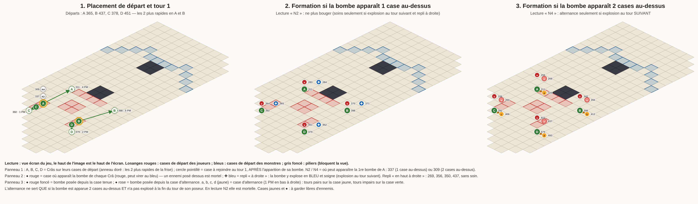

# Reine des Voleurs : stratégie pour 4 Crâs identiques (règle des bombes confirmée)

Donjon 83 « Trône de la Cour Sombre », carte 137101312 « Traversée », Reine 3726, 4 personnages, objectif : **victoire
simple**. Version du 2026-10-09, **relue et corrigée** le même jour (scripts et sorties de la relecture :
`review/`). Les chemins `search/`, `verify/`, `damage/`, `review/` et `strategy/` sont relatifs à
`tools/reine-des-voleurs/v2/`. Elle remplace la formation du [README](README.md), qui échoue sous la règle
d'apparition que tu as donnée (0 ordre de jeu sûr sur 24, dans les 10 lectures de la règle).

**D'où viennent les affirmations :**

| Étiquette | Origine |
|---|---|
| **[S]** | Mesuré dans le modèle des bombes (le modèle du README étendu aux 5 lectures de ta règle, 30 tours de jeu, 24 ordres de jeu des Crâs, 2 ordres de réaction en chaîne). |
| **[V]** | Mesure [S] **reproduite par un second simulateur écrit indépendamment**. |
| **[D]** | Données du jeu (DofusDB 3.6) lues dans le dépôt. |
| **[M]** | Mesuré dans le moteur du simulateur, avec tes caractéristiques. |
| **[E]** | Source externe (wiki, vidéos), déjà citée dans le README. |
| **[R]** | Raisonnement : à vérifier en jeu. |

---

## 0. En bref

1. **Placement.** Regarde la frise pendant le placement. Les **2 Crâs qui jouent en premier** vont en **A = 365** et
   **B = 437**. Les deux autres vont en **C = 378** et **D = 451**.
2. **Tour 1.** Chaque Crâ attend que sa bombe apparaisse, puis se déplace :
   - A : 365 → **311** (4 PM) ;
   - B : 437 → **398** (5 PM) ;
   - C : 378 → **392** (1 PM) ;
   - D : 451 → **479** (2 PM).
3. **Lis la règle sur la 1re bombe de A**, qui apparaît pendant que A est encore en 365 :
   - en **337**, une case au-dessus de lui (lecture **N2**) : plus personne ne bouge, jamais ;
   - en **309**, deux cases au-dessus (lecture **N4**), il faut savoir si elle explose à la fin du tour 1 de A :
     - si **elle n'explose pas** (explosion au tour suivant), chaque Crâ **alterne** à partir du tour 2 avec la case
       voisine **en bas à droite** (1 PM) : 311↔325, 398↔412, 392↔406, 479↔493. Il est sur la case jaune aux tours
       pairs et sur sa case aux tours impairs ;
     - si **elle explose** (même tour), plus personne ne bouge.
4. **Résultat mesuré [V].** Aucune mort par bombe pendant 30 tours :
   - dans **les 10 lectures** de ta règle (case d'apparition, case de repli, moment d'explosion) ;
   - pour **les 24 ordres de jeu**, sauf dans la lecture « N2 + explosion au même tour ». Celle-ci exige que A et B
     jouent avant C et D, d'où le placement par la frise. Avec ce placement, c'est **10 lectures sur 10**.
   - La règle inconnue (N et repli tous deux occupés) **ne sert jamais**.
   - Relecture : vérifié aussi dans une 11e lecture, repli « case à droite de la case N4 » (« sa diagonale » au sens
     Dofus) : 24/24 dans les deux moments [S] (`review/r2-robustesse.txt`).
   - **Ce résultat suppose qu'aucun monstre ne touche aux cases de bombe et que chaque Crâ finit bien son tour sur sa
     case.** Les deux écarts sont mortels (§2.2, §2.5) : ce sont eux, pas la règle des bombes, qui feront perdre.
5. **Pesanteur sur la Reine avant chacun de ses tours**, grâce à Représailles. Elle empêche l'échange de Mort en
   Sursis [D][M] et les téléportations de Brume [D]. Représailles touche une **croix de 5 cases** : vise la Reine **ou
   une case collée à elle**, par exemple le Crâ qu'elle vient de cibler. Les 3 autres Crâs peuvent alors toujours la
   toucher (§2.4).
6. **La Reine doit mourir avant son 7e tour.** Mort en Sursis n'est retiré par une bombe bleue que dans une seule
   lecture : N2, repli « à droite », explosion au tour suivant [S].
7. **Si un Crâ meurt, les autres gardent leur plan** (sans bouger, ou en continuant l'alternance en N4 + tour
   suivant). C'est mesuré sans aucune mort supplémentaire, même avec 2 Crâs morts [S]. En revanche, **un Crâ déplacé**
   de sa case est très dangereux : 15 à 77 % de risque de mort selon la lecture et la distance [S].
8. **Trois réflexes ajoutés par la relecture** (mesurés [S], `review/`) :
   - **Ne sors de ta case que si ton retour est certain.** En N2, sors seulement en **284** (A) ou **371** (B). En N4,
     sors seulement en **297** (A) ou **384** (B). L'autre case de sortie est en ligne avec ta propre bombe : si tu y
     restes coincé, tu meurs à la fin du tour (55 à 100 %) (§2.2).
   - **Bombe chassée par un monstre** : si un **monstre** occupe la case habituelle de ta bombe et qu'elle apparaît **2
     cases en haut à droite de toi**, elle est en ligne avec toi et un 2e Crâ. Va sur la case **juste à droite** de la
     tienne (2 PM), tire **Flèche de Recul** sur ta bombe (elle monte de 2 cases), puis rentre. Mesuré : 42 à 100 % de
     parties avec une mort sans ce geste, 0 % avec (§2.5). Ne le fais **pas** quand c'est ta propre bombe précédente
     qui occupe la case : en N2 + tour suivant, ce repli est normal et c'est lui qui soigne.
   - **En N4 + tour suivant**, si ta case d'alternance est prise, va sur la case **juste en haut à droite de ta case
     tenue** (297, 384, 378, 465) : 0 mort. Rester sur place coûte une mort dans 30 % des cas si le repli est la case
     NE à 2 cases (§2.1).
9. **Sentinelle ne peut pas être lancée au tour 1** (relance initiale d'un tour [D]). C la lance au tour 2.

---

## 1. La formation retenue (F-A)

### 1.1 Pourquoi celle-là

Trois formations ont survécu à la recherche. Elle était exhaustive : 11,4 millions d'ensembles de 4 cases, puis toutes
les transitions depuis les cases rouges. Les trois formations ont été recomptées par un second simulateur [V].

| Formation | Lectures tenues, ordre de jeu quelconque | Avec A et B en tête de la frise | Crâ décalé d'une case (N2, tour suivant) | Ligne de vue |
|---|---|---|---|---|
| **F-A (retenue)** : 311 / 398 / 392 / 479 | 8 sur 10 (casse en N2 + même tour : 4 ordres sur 24) | **10 sur 10** | mortel dans 59 % des cas | bonne pour A et B |
| F-C : 297 / 370 / 392 / 464 | 8 sur 10 | 10 sur 10 | 68 % | la meilleure, mais cases plus avancées |
| F-B : 270 / 381 / 392 / 425 | 4 sur 10 (N2 seulement) | 4 sur 10 | 44 % | très bonne pour un seul Crâ |

- **Plafond démontré.** Aucun départ rouge n'est sûr à la fois en N2 et en N4 « au même tour » [V]. Aucune formation
  immobile ne tient en N4 + tour suivant quand le repli est la case NE à 2 cases [S] : il faut l'alternance. On ne peut donc pas faire mieux que 8 sur 10 sans contrainte
  sur la frise.
- **F-A plutôt que F-C.** Elle est moins exposée aux décalages et aux ennemis : ses cases sont plus en retrait.
- **Le seul point faible de F-A** est une dépendance : une bombe bleue doit faire virer au bleu ses diagonales.
  Sinon, la lecture N2 + tour suivant tombe à 18 ordres sur 24. Les 6 ordres perdus sont ceux où D joue en premier,
  que le placement par la frise exclut déjà. Les données disent que la bombe bleue le fait [D].

### 1.2 Placement de départ (phase de placement)

| Crâ | Case de départ | Qui | Case tenue | PM au tour 1 |
|---|---|---|---|---|
| **A** | **365** | 1er ou 2e de la frise | **311** | 4 |
| **B** | **437** | 1er ou 2e de la frise | **398** | 5 |
| **C** | **378** | 3e ou 4e | **392** | 1 |
| **D** | **451** | 3e ou 4e | **479** | 2 |

Les 4 Crâs ont 2 690 d'initiative à quelques points près. La frise de placement montre l'ordre réel : c'est elle qui
décide qui va en A et en B. Peu importe qui de A ou de B joue en premier, et qui de C ou de D. Il faut seulement que A et
B jouent tous les deux **avant** C et D. Les 4 ordres sûrs dans tous les cas sont 365→437→378→451, 365→437→451→378,
437→365→378→451 et 437→365→451→378 [V].

**À noter aussi pendant le placement :**
- **la case de la Reine** : elle décide qui pose Pesanteur au tour 1 (§2.4) ;
- **les 4 cases bleues occupées par la vague 1** : les vagues 2 à 5 apparaîtront sur ces mêmes cases [E].

### 1.3 Tour 1

Chaque Crâ se déplace **après** l'apparition de sa bombe. C'est automatique : la bombe apparaît au début du tour,
avant toute action. Le chemin n'est jamais bloqué, ni par les Crâs ni par les bombes [V]. Attention : A n'a **qu'un
seul chemin à 4 PM** (365 → 351 → 338 → 324 → 311, en ligne droite). Si l'une de ces cases est prise, il lui faut 6 PM
et il n'arrive pas au tour 1 [S] (`review/r1-geo.txt`). Au tour 1, aucun monstre ne peut y être.

| Ordre | Crâ | Bombe 1 (N2 / N4) | Déplacement | Ensuite |
|---|---|---|---|---|
| 1er ou 2e | A | 337 / 309 | 365 → 311 (4 PM, il reste 1 PM) | Pesanteur si la Reine est à gauche (§2.4), puis tir |
| 1er ou 2e | B | 409 / 381 | 437 → 398 (5 PM, il reste 0 PM) | Pesanteur si la Reine est à droite (§2.4), puis tir |
| 3e ou 4e | C | 350 / 322 | 378 → 392 (1 PM) | rien d'utile à portée en général ; **pas de Sentinelle** (relance initiale d'un tour : elle n'est lançable qu'à partir du tour 2) ; c'est C qui teste la limite de Représailles (§2.4) |
| 3e ou 4e | D | 423 / 395 | 451 → 479 (2 PM) | tir si un monstre est en 319 ou 234 |

### 1.4 Lire la règle des bombes au tour 1

| Ce que tu vois | Lecture | Ce que tu fais pour tout le combat |
|---|---|---|
| Bombe de A en **337**, elle **n'explose pas** à la fin du tour 1 de A | N2, tour suivant (les 2 replis possibles) | Ne plus jamais bouger. Les bombes bleues soignent **si le repli est la case à droite** (§1.5). |
| Bombe de A en **337**, elle **explose** à la fin du tour 1 de A | N2, même tour | Ne plus jamais bouger. Aucun soin par bombe. |
| Bombe de A en **309**, elle **n'explose pas** | N4, tour suivant (les 4 replis possibles) | **Alternance** à partir du tour 2 (tours pairs sur la case jaune). Aucun soin par bombe. |
| Bombe de A en **309**, elle **explose** | N4, même tour | Ne plus jamais bouger. Aucun soin par bombe. |

- **Erreurs mesurées [V] :**
  - appliquer l'alternance en lecture N2 est **mortel** (0 ordre sûr sur 24) ;
  - l'oublier en N4 + tour suivant est mortel si le repli est la case NE à 2 cases du Crâ (0 sur 24), sans effet
    avec les trois autres replis (`review/r11-f-statique.txt`). Comme on ne voit jamais de repli en N4 avec F-A,
    alterne toujours dans ce cas ;
  - l'appliquer en N4 + même tour est sans effet ;
  - **la rater une seule fois** (0 PM, case jaune prise, tacle) en N4 + tour suivant : une mort dans **30 %** des
    parties si le repli est la case NE à 2 cases, 0 % avec les autres replis [S] (`review/r2-robustesse.txt`, partie b).
    Parade au §2.1.
- **La 2e partie de ta règle** (« si la case est occupée, en haut à droite ») ne change rien aux déplacements. F-A tient
  les deux lectures du repli : la case **à droite** de la case N (à 2 cases du Crâ, en ligne avec lui), ou celle **en
  haut à droite** de N. Elle décide seulement s'il y a des soins (§1.5). On le voit au tour 3 en N2 + tour suivant :
  la bombe de B passe en repli, en **371** (à droite) ou en **356** (en haut à droite).

### 1.5 Ce qui se passe ensuite (traces [V], ordre A→B→C→D)

**Lecture N2, explosion au tour suivant, repli à droite :**
- **Bombes primaires :** 283 (A), 370 (B), 364 (C) et 451 (D).
- **Replis :** 284, 371, 365 et 452. Une bombe de repli explose toujours **en bleu**.
- **Explosions rouges :** sur les 4 cases primaires (et sur les bombes du tour 1), jamais en ligne avec un Crâ.
- **Soins :** une bombe bleue soigne à 100 % et **retire Mort en Sursis**. Mesuré : chaque Crâ est soigné au moins une
  fois tous les 4 tours, le 1er soin arrivant au plus tard au tour 6 (48 cas sur 48) [V].
  - Exemple : au tour 4, la bleue de 371 soigne B et D ; au tour 5, celle de 365 soigne A et C ; au tour 6, celle de
    452 soigne B et D.

**Lecture N2, explosion au tour suivant, repli en haut à droite :** mêmes bombes primaires, replis en 269, 356, 350 et
437. Il y a des explosions rouges et bleues, mais aucune n'est en ligne avec un Crâ : **ni mort, ni soin** [S].

**Lecture N2, explosion au même tour :** les 4 bombes explosent en rouge à chaque tour (283, 370, 364, 451). Il n'y a
jamais de bleue, donc jamais de soin.

**Lecture N4 :**
- Bombes en 255, 342, 336 et 423 depuis les cases tenues.
- Avec l'alternance, bombes en 269, 356, 350 et 437 depuis les cases jaunes.
- Il y a des explosions rouges et quelques bleues, mais **aucune n'est en ligne avec un Crâ** : ni mort, ni soin.

**Pendant le tour d'un Crâ**, environ 4 bombes sont en vie en « tour suivant », et au plus 1 en « même tour ». Chaque
bombe vivante réduit de 10 % les dégâts que subit la Reine (§4.2).

---

## 2. Règles de jeu

### 2.1 Cases à tenir

| Crâ | Case tenue | Case d'alternance (N4 + tour suivant seulement) |
|---|---|---|
| A | 311 | 325 (tours pairs) |
| B | 398 | 412 (tours pairs) |
| C | 392 | 406 (tours pairs) |
| D | 479 | 493 (tours pairs) |

**La règle d'or :** chaque Crâ **finit chacun de ses tours** sur la case prévue. Il peut sortir pour tirer, mais il
revient avant de passer son tour. Une sortie en cours de tour ne déclenche rien : les bombes apparaissent au début des
tours et explosent à la fin. **Le chrono du tour compte** : avec 4 comptes, garde toujours de quoi rentrer avant la fin
du temps ; un Crâ resté dehors à la fin du tour est en danger de mort (§2.2).

**Case de secours (N4 + tour suivant seulement)** [S] (`review/r6-plan-b.txt`, 4 lectures N4, 24 ordres, manches 2
à 12) :
- si ta **case prévue est prise** par un monstre, ou si tu ne peux pas l'atteindre, va sur la case **juste en haut à
  droite de ta case tenue** : **297** (A), **384** (B), **378** (C), **465** (D). C'est 0 mort, aux tours pairs comme
  impairs ;
- rester où tu es coûte une mort dans 30 % des parties si le repli est la case NE à 2 cases (7–8 % en moyenne sur les
  4 lectures N4) ;
- **sans PM** (Tournoyade, Coupe Circulaire, tacle), **Pas Chassé** (2 PA, sans PM, insensible au tacle) fait le pas
  à ta place : depuis ta case tenue, vers ta case jaune ou vers la case de secours (toutes deux en ligne, à 1 case) ;
  depuis ta case jaune, vers ta case tenue. Garde-le pour ça en N4 + tour suivant : il a une relance de 2 tours et il
  est **interdit sous Pesanteur** [D].

### 2.2 Sorties de tir autorisées (aller-retour dans le même tour)

Elles sont mesurées sur les 114 cases de la zone d'approche et les 12 cases bleues [S].

| Crâ | Depuis sa case | Sortie à 1 PM | Sortie à 2 PM | Remarque |
|---|---|---|---|---|
| A (311) | 56 cases, 5 ou 6 cases bleues à 11 | **297** (66 cases, 7 bleues) | **284** (80 cases, 8 bleues à 9–14) | 284 et 297 sont **en ligne** avec 311 : retour en **Pas Chassé** possible |
| B (398) | 43 cases ; 263, 291, 319 à 10 ; 234, 235 à 12 | **384** (60 cases, 7 bleues) | **371** (80 cases, 8 bleues à 8–15) | 371 et 384 sont en ligne avec 398 : retour en **Pas Chassé** possible |
| C (392) | 12 cases | 378 (14) | 365 (15) | presque rien à gagner : préfère **Flèche Harcelante** (sans ligne de vue) |
| D (479) | 8 cases ; 319 à 16 | 465 (9) | 480 (12) | idem |

**Une sortie ratée tue (relecture, mesuré [S], `review/r2-robustesse.txt` partie c).** Crâ qui finit **un seul** tour
sur sa case de sortie, puis rentre au tour suivant (proportion de parties avec une mort) :

| Lecture | A en 297 | A en 284 | B en 384 | B en 371 |
|---|---|---|---|---|
| N2, repli à droite, tour suivant | 58 % | **0 %** | 55 % | **0 %** |
| N2, même tour (les deux replis) | 100 % | **0 %** | 100 % | **0 %** |
| N2, repli en haut à droite, tour suivant | 81 % | 39 % | 78 % | 37 % |
| N4 (4 lectures), tour suivant | **0 %** | 78–81 % | **0 %** | 78 % |
| N4 (4 lectures), même tour | **0 %** | 100 % | **0 %** | 100 % |

La raison est simple : en N2, 297 et 384 sont **en ligne avec ta propre bombe** (283, 370) ; en N4, 284 et 371 sont en
ligne avec ta bombe (255, 342). D'où la règle :
- **en N2, sors seulement en 284 (A) ou 371 (B)** ; **en N4, seulement en 297 (A) ou 384 (B)** ;
- C et D ne sortent pas : ils n'ont presque rien à voir (premier tableau), et leurs sorties suivent la même logique
  (378 et 465 sont en ligne avec leur bombe en N2). Ils tirent en Flèche Harcelante.

**Conditions d'une sortie :**
- garder de quoi revenir : 2 PM par aller-retour, plus 1 PM d'alternance si besoin. Avec 5 PM, la sortie est donc au
  plus à 2 PM ;
- **Pas Chassé n'est pas une garantie** : 2 PA, téléportation insensible au tacle et au retrait de PM, mais **relance
  de 2 tours** (un tour sur deux) et **impossible sous Pesanteur** [D] (`statesCriterion` « !7 »). Or Représailles
  pose aussi Pesanteur sur les **alliés** de sa croix (§2.4), et Tournoyade en pose une de 2 tours. Il faut aussi une
  ligne de vue vers ta case (297 entre 284 et 311, 384 entre 371 et 398) ;
- **ne sors jamais si tu es au contact d'un ennemi**, et ne finis jamais ta sortie au contact d'un ennemi. Avec ta Fuite
  de 23 contre un Tacle d'environ 80 (Agilité 800–850 des monstres, à vérifier en jeu), quitter le contact d'**un**
  monstre te laisse environ **1 PM et 2 PA** ; au contact de deux, 0 PM [R] (formule du dépôt, `src/damage/tackle.ts`) ;
- ne passe jamais par une case piégée. Les pièges ennemis sont invisibles et **ne sont pas sur la case visée** : ils
  sont posés sur les 4 cases à 2 cases de la cible, **en ligne** pour le Mâchassin (Piège à Le Ours : autour de A en
  311, il y en a un en **284**) et **en diagonale** pour la Magouille (Crâmes : 2 cases au-dessus, en dessous, à gauche
  et à droite à l'écran) [D] ;
- 284, 371 et 365 sont aussi des cases de repli des bombes : si une bombe y est, la sortie est impossible ;
- **Flèche du Jugement perd des dégâts pour chaque PM dépensé avant le tir** : lance-la **avant** de sortir.

### 2.3 Ce qu'il ne faut jamais faire

1. **Finir un tour ailleurs que sur sa case**, ou que sur sa case jaune aux tours pairs en N4 + tour suivant.
2. **Alterner en lecture N2**, ou **ne pas alterner en N4 + tour suivant** (§1.4).
3. **Laisser la Reine commencer un tour sans Pesanteur** (§2.4). Un Crâ décalé d'une case, même s'il revient à son tour,
   provoque une mort [V] :
   - dans 59 % des cas en N2 + tour suivant ;
   - dans 75 % des cas en N2 + même tour ;
   - dans 15 à 24 % des cas en N4 + tour suivant ;
   - dans 0 % des cas en N4 + même tour.
4. **Déplacer un allié ou une bombe**, sauf le sauvetage d'une bombe chassée par un monstre (§2.5). Tous ces sorts
   poussent ou attirent aussi les alliés et les Bonbombes :
   - Flèche de Recul et Flèche Évasive **sur un allié ou une bombe** ;
   - Flèche de Barrage ;
   - Flèche de Dispersion ;
   - Vendetta ;
   - Balise Tactique.
5. **Se déplacer soi-même par un sort**, sauf pour revenir sur sa case avec Pas Chassé :
   - Tir de Repli : le lanceur recule ou avance de 2 cases [D][M] ;
   - Flèche Évasive **au contact** : le lanceur recule de 2 cases [D].
6. **Sorts de zone à moins de 3 cases d'un autre Crâ** : Pluie de Flèches, Massacrante, Œil pour Œil, retour de
   Boomerang. Ils touchent les alliés. Les bombes, elles, sont invulnérables.
7. **Laisser une invocation, une balise ou un Crâ en fin de tour** sur une case de bombe ou de repli : une case occupée
   change la case d'apparition des bombes.
8. **Utiliser Tirs Puissants avant un tir lointain.** Il **retire 3 PO** à tous les sorts du tour : Représailles passe
   de 3–10 à 3–7, et Flèche du Jugement de 3–13 à 3–10.

### 2.4 Pesanteur : Représailles sur la Reine, qui et quand

**Pourquoi c'est vital.**
- Pesanteur (état 7) sur la Reine empêche l'**échange** de Mort en Sursis [D][M]. Elle avance quand même et pose
  Mort en Sursis : seul l'échange est bloqué.
- Les données conditionnent aussi les **téléportations de Brume** à l'absence de Pesanteur sur la Reine. Le masque est
  « a,A,*e7 », et l'astérisque porte la condition sur le lanceur [D]. Brume arrive à son tour 4, puis tous les 3 tours.
- Pesanteur dure jusqu'au **début du tour suivant du lanceur** [M]. La Reine joue exactement une fois entre-temps :
  **un lancer couvre son prochain tour**, quel que soit le Crâ qui le fait.

**Contraintes du sort.**
- 3 PA, portée 3–10 avec tes 4 PO. Sous **Tirs Éloignés**, la portée passe à 6–16 [D] ; sous Tirs Puissants, à 3–7.
- Ligne de vue obligatoire.
- Relance de 3 tours par Crâ.
- **Au plus 1 lancer par tour pour toute l'équipe**, d'après les données (maxGlobalCastPerTurn = 1).
- **Zone : une croix de 5 cases** (la case visée et ses 4 voisines en ligne). Pesanteur touche **tout ce qui est dans
  la croix, alliés compris** (masque « a,A ») ; les dégâts et le ×110 % ne touchent que les ennemis [D]. Le sort
  n'exige ni case libre ni case occupée [D].

**Où viser (relecture, mesuré [S], `review/r3-represailles.txt`).** Après Mort en Sursis, la Reine est **collée en
ligne** à sa cible : elle est donc dans la croix de 5 cases centrée sur ce Crâ, ou sur n'importe quelle case voisine
d'elle.
- En visant **seulement la case de la Reine**, depuis les cases tenues ou une sortie qui ne tue pas si l'on y reste
  coincé (§2.2), et sans compter le Crâ collé à elle (il est taclé et à moins de 3 cases) : **0 Crâ** dans 1 cas sur 14,
  **1 seul Crâ** dans 5 à 7 cas sur 14–16. Avec 2 Crâs seulement disponibles par tour (relance 3), la rotation a
  alors des trous.
- En visant **la Reine ou une case voisine d'elle** (dont la case du Crâ qu'elle vient de cibler) : **les 3 autres
  Crâs** peuvent la toucher dans **14 cas sur 14** (N2) et **16 sur 16** (N4), dont au moins 2 depuis leur case.
- **Exception en N4 + tour suivant** : le Crâ collé à la Reine aura besoin de Pas Chassé pour alterner (il est taclé),
  et Pesanteur le lui interdit. Vise alors la case **de l'autre côté de la Reine**, ou une case voisine d'elle sur le
  côté, pour que la croix la touche sans toucher ce Crâ. Mesuré : 3 Crâs capables dans 28 cas sur 30, 2 dans 1 cas,
  1 seul dans le dernier (Reine en 312 après Mort en Sursis sur A en 325 : seul C la touche).
- Que le jeu accepte de viser une case occupée par un allié est déduit des données, pas vu en jeu [R] : sinon, vise
  une case libre voisine de la Reine.

**Tour 1 : seul le Crâ exposé la pose.** La Reine ne peut lancer Mort en Sursis au tour 1 que sur A en 311 ou sur B en
398, et seulement s'il est déjà arrivé quand elle joue [S] :

| Case de départ de la Reine | Crâ exposé au tour 1 | PM qu'il lui faut | Ce que fait ce Crâ juste après son déplacement |
|---|---|---|---|
| 159, 160, 161, 162 ou 190 (à gauche) | A en 311 | 6 | **Tirs Éloignés** (1 PA) puis **Représailles** sur la Reine, à 11 cases, en vue |
| 263, 291 ou 319 (en bas à droite) | B en 398 | 5 | **Représailles** directement (10 cases, en vue), sans Tirs Puissants avant |
| 234 ou 235 | personne (7 PM) | — | B la pose quand même, sous Tirs Éloignés (12 cases), pour couvrir son tour 2 |
| 205 ou 219 | personne (7–8 PM) | — | personne ne la voit : le premier qui la voit au tour 2 la pose |

Les cases de départ (365, 378, 437, 451) sont hors de sa portée au tour 1 : il lui faudrait 10 à 15 PM [S].

**Tours suivants : rotation sur 3 Crâs, le 4e en réserve.**
- Exemple, si A a posé au tour 1 : A aux tours 1, 4, 7 ; B aux tours 2, 5, 8 ; **le premier de C ou D qui la voit**
  aux tours 3, 6, 9.
- Si c'est B qui a commencé : B aux tours 1, 4, 7 ; A aux tours 2, 5, 8 ; C ou D aux tours 3, 6, 9.
- Mesure [S] : après qu'elle a lancé Mort en Sursis, la Reine finit au contact de sa cible.
  - **Ancienne mesure, corrigée par la relecture** : elle comptait le Crâ collé à la Reine (il est taclé) et des
    sorties où rester coincé est mortel (§2.2). En visant sa seule case, il reste **0 ou 1 Crâ** capable dans 6 à 8
    cas sur 14–16 : avec 2 Crâs disponibles par tour, la rotation a des trous.
  - **En visant la croix** (la Reine ou une case collée à elle, voir « Où viser ») : les 3 autres Crâs dans tous les
    cas mesurés, dont au moins 2 depuis leur case. C'est ce qui rend la rotation tenable.

**Contrôle avant chaque tour de la Reine :** l'icône Pesanteur doit être sur elle, avec son compteur de tours.

**Si le jeu refuse un 2e Représailles dans le même tour de jeu** (la limite d'équipe s'applique au tour de jeu
entier), l'ordre dans la frise compte :
- un lancer fait **avant** la Reine dans la frise couvre son tour **de ce tour de jeu** ;
- un lancer fait **après** elle couvre son tour **du tour de jeu suivant** ;
- passer d'un lanceur placé **avant** elle à un lanceur placé **après** elle laisse un de ses tours sans Pesanteur
  (l'inverse est sans risque). Garde donc toujours le même côté : il faut au moins 3 Crâs de ce côté pour tenir la
  relance de 3.
- **Comment tester la limite au tour 1** (seulement si A ou B a déjà lancé Représailles ce tour-ci) : c'est **C** (3e ou
  4e Crâ) qui essaie un Représailles, sur n'importe quelle case à 3–10 cases (une case vide suffit). Si le jeu refuse,
  rien n'est perdu. S'il accepte, la limite ne vaut que par tour de Crâ, et seul C a dépensé sa relance : A et B
  restent libres pour les tours 2 et 3. Ne fais pas le test avec B : s'il réussit, A et B sont tous deux en relance aux
  tours 2 et 3, alors que C et D voient rarement la Reine à ce moment-là.
- Avec 2 Crâs de chaque côté, un tour de la Reine sur 4 reste sans Pesanteur [R]. **C'est une raison de plus de la
  tuer vite** (§4.2).

### 2.5 Cases à garder libres d'ennemis

Un ennemi (monstre, double de la Doublure, Bombe Illicale) posé sur une case de bombe **au moment où son Crâ commence
son tour** déplace la bombe vers une case dangereuse [V]. Entre parenthèses : combien de PM il faut à un monstre depuis
la case bleue la plus proche [S] (`review/r10-pm-bleues.txt`).

| Lecture | Cases interdites aux ennemis (PM depuis la case bleue la plus proche) |
|---|---|
| N2 (les deux moments) | **283** (9), **370** (10), 364 (15), 451 (16) |
| N4 + tour suivant | **255** (7), **342** (8), 269 (8), 356 (9), 336 (13), 350 (14), 423 (14), 437 (15) ; et les cases d'alternance 325 (10), 412 (9), 406 (16), 493 (15), ainsi que les cases tenues aux tours impairs (secours au §2.1) |
| N4 + même tour | **255** (7), **342** (8), 336 (13), 423 (14) |

**Corrections de la relecture** [S] (`review/r2-robustesse.txt` partie d, `review/r7-n4-meme.txt`) :
- La ligne « N4 + même tour : aucune » était **fausse**, et la ligne « N4 + tour suivant » oubliait 255, 342, 336 et
  423. Ces deux listes n'avaient pas été mesurées : elles étaient écrites à la main dans `mesures.ts`.
- En N4 + même tour, avec le repli « NE à 2 cases » ou « NE à 4 cases », **un seul** monstre sur 255 au début du tour de
  A tue **A et C** (la bombe de repli est en ligne avec les deux). De même, 342 tue B et D, 336 tue A et C, 423 tue B et
  D. Avec les deux autres replis, il n'y a aucune mort.
- Si un monstre occupe la case habituelle au moment où le Crâ commence son tour, il y a au moins une mort dans **42 %**
  des parties (N2, repli à droite, tour suivant), **57 %** (N4, repli NE à 2 cases, tour suivant) et **100 %** (même
  tour) [S] (`review/r9-urgence-sim.txt`).

**Personne ne peut chasser l'ennemi « juste avant ».** La frise alterne les équipes : **un monstre joue toujours entre
deux Crâs**. Il peut donc entrer sur la case après le tour du Crâ précédent. La défense est donc la suivante :
1. **Prévenir** : à chaque tour, repère les monstres qui peuvent atteindre une case interdite à leur prochain tour
   (distance à pied au plus égale à leurs PM : 3 à 6). Repousse-les avec **Flèche de Recul**
   (2 cases, 3 PA, PO 1–10) ou **Flèche Évasive** à distance (2 cases, 3 PA), ou tue-les en priorité. Ne tire jamais à
   travers un allié ou une bombe. La Bombe Illicale, elle, ne peut pas être poussée [D].
2. **Sauver sur le coup** : si ta bombe apparaît **2 cases en haut à droite de toi** parce qu'un **monstre** occupait sa
   case habituelle, elle est en ligne avec toi et avec le Crâ de ta colonne (A et C, ou B et D).
   - Va sur la case **juste à droite de ta case** : **312** (A), **399** (B), **393** (C), **480** (D), à 2 PM.
   - Tire **Flèche de Recul** sur ta bombe. Elle monte de 2 cases à l'écran (228, 315, 309, 396) et n'est plus en ligne
     avec personne.
   - Rentre sur ta case, ou sur ta case jaune un tour pair en N4 + tour suivant (1 PM de plus).
   - Mesuré : de 42–100 % de parties avec une mort à **0 %**, en N2 (repli à droite) et en N4 (repli NE à 2 cases),
     pour les deux moments d'explosion [S] (`review/r8-urgence.txt`, `review/r9-urgence-sim.txt`).
   - Si tu commences ton tour sur ta case **jaune** (N4 + tour suivant, tour impair), la case de tir est la case juste
     en haut à droite de ta case tenue (297, 384, 378, 465), puis 1 PM pour rentrer (`review/r8b-urgence-jaune.txt`).
   - Quand la bombe apparaît **4 cases** en haut à droite (repli NE à 4 cases), il n'existe pas de sauvetage : seule la
     prévention marche.
   - Ne le fais **jamais** quand c'est ta propre bombe précédente qui occupe la case habituelle (repli normal en N2 +
     tour suivant : cette bombe deviendra bleue et soignera).

### 2.6 Si un Crâ meurt, ou s'il est déplacé

- **Un Crâ meurt** (dégâts, Bombe Illicale, Mort en Sursis) : ses bombes explosent aussitôt. **Les survivants gardent
  leur plan** : ils ne bougent pas, sauf l'alternance en N4 + tour suivant, qui continue. L'arrêter serait mortel
  (§1.4).
  - Mesures, dans les 10 lectures, pour tous les ordres, mort aux tours 2 à 10 [S] :
    - 1 mort : 0 mort supplémentaire ;
    - 2 morts : 0 mort supplémentaire ;
    - 1 Crâ tué en même temps que toutes les bombes à 3 cases de lui (le cas Bombe Illicale) : 0 mort supplémentaire ;
    - une bombe tuée avant son heure : 0 mort supplémentaire.
  - Avec 3 Crâs, la rotation de Pesanteur tient encore (relance 3), mais sans marge.
- **Un Crâ déplacé** (échange, attraction, poussée) **est bien plus grave qu'un Crâ mort.**
  - Mesure [S] : un Crâ attiré de 1 à 6 cases en ligne, bloqué 2 tours puis rentré, entraîne une mort dans 30 à 77 %
    des cas selon la distance et la direction.
  - Rentre **le plus tôt possible**, avec Pas Chassé si tu es en ligne à 1 ou 2 cases de ta case et pas sous
    Pesanteur, sinon à pied.
  - **Dernier recours [R], non mesuré en jeu :** si un Crâ est bloqué loin de sa case pour plusieurs tours (Tournoyade
    du Bourôliste : −10 PM et Pesanteur pendant 2 tours), le modèle dit qu'il est plus sûr pour les 3 autres qu'il
    quitte le combat avant son tour suivant. Vérifie d'abord qu'un abandon fait bien exploser ses bombes comme une mort.

---

## 3. Variantes de sorts (les mêmes pour les 4 Crâs)

**Vecteur des variantes :** `[0,1,1,0,0,0,0,1,0,1,0,0,1,1,0,1,0,1,0,1,0,1]` (0 = sort de base, 1 = variante).

L'analyse de dégâts proposait **Balise Tactique** (paire 5) et **Tir Perçant** (paire 6). Je les remplace par **Pas
Chassé** et **Tirs Éloignés**, pour la sécurité et la portée de Représailles. Les dégâts infligés ne limitent pas ce
combat : c'est la ligne de vue et la tenue de la formation qui le limitent [M]. Les dégâts **reçus**, eux, sont un
vrai risque (§4.5).

| Paire | Choix | Pourquoi |
|---|---|---|
| 1 | **Flèche de Recul** | Repousse de 2 cases l'ennemi posé sur une case de bombe. Bon sort Air contre le Mâchassin (526). |
| 2 | **Flèche Harcelante** | **Sans ligne de vue** (PO 1–10) : le sort de C et D. Réduit à 70 % les soins reçus (Magouille). Les dégâts de Glacée sont équivalents. |
| 3 | **Flèche Évasive** | Repousse de 2 cases à distance. **Jamais au contact** : là, c'est le lanceur qui recule de 2. Vagabonde déplace toujours le lanceur. |
| 4 | Flèche de Barrage | Sans usage près de la formation : les deux sorts poussent les alliés. |
| 5 | **Pas Chassé** (au lieu de Balise Tactique) | Retour sur sa case depuis 284 ou 297 (A), 371 ou 384 (B), ou pas d'alternance sans PM (N4) : insensible au tacle et au retrait de PM, +1 PM au tour suivant. **Mais** relance de 2 tours (un tour sur deux), ligne de vue exigée et **interdit sous Pesanteur** [D] : ce n'est pas une garantie (§2.2). La balise occupe une case et, frappée, attire tout à 3 cases, alliés compris. Coût : −1 à −3 % de dégâts (moteur), jusqu'à −8 % (données). |
| 6 | **Tirs Éloignés** (au lieu de Tir Perçant) | Représailles à 6–16 : **Pesanteur au tour 1 à 11 cases** (A) et à 12 cases (B). Tir Perçant n'apporte que 0 à 2 % [M]. |
| 7 | Flèche Détonante | Mieux que Ralentissante. Bonne contre Bourôliste et Terristocrate. |
| 8 | **Flèche Persécutrice** | Cible unique. Son 2e coup part si la cible quitte la ligne de vue. |
| 9 | Flèche Cinglante | Flèche Assaillante fait avancer le lanceur : interdite. |
| 10 | **Flèche Tyrannique** | Nettement mieux que Immobilisation (1,15 tour de jeu de moins sur le combat). |
| 11 | Tirs Puissants | +4 à +8 % de dégâts, **mais −3 PO** : seulement contre une cible proche, et toujours après Représailles. |
| 12 | Flèche de Dispersion | Jamais près de la formation. Flèches Enflammées déplace le lanceur. |
| 13 | **Flèche Massacrante** | Zone plus petite que Explosive. |
| 14 | **Pluie de Flèches** | Seulement sur une cible isolée, à 3 cases ou plus de tout Crâ. |
| 15 | Œil pour Œil | Zone plus petite que Paralysante. |
| 16 | **Représailles** | **Obligatoire sur les 4** : Pesanteur et ×110 % de dégâts subis par les ennemis de la croix. |
| 17 | Tir de Repli | Ne pas l'utiliser en formation (il déplace le lanceur). Vendetta attire les alliés : pire. |
| 18 | **Flèche du Jugement** | Le meilleur sort : 832 contre la Reine, 1 353 contre la Doublure. **À lancer avant de bouger.** |
| 19 | Flèche d'Expiation | Portée 6–16 : idéale depuis la formation. Meilleur sort Eau à 6 cases ou plus. Réduit les soins de moitié. |
| 20 | **Flèche Boomerang** | Bon sort Air (Mâchassin, Magouille, Reine). Son retour touche les alliés. |
| 21 | Flèche Dévorante | Le meilleur sort Feu (Bourôliste 829, Terristocrate 621). 4 lancers par tour pour l'équipe. |
| 22 | **Sentinelle** | +20 % de dégâts à distance et +10 PO pendant 2 tours ; **dévoile les invisibles** (Brume, Doublure) au moment du lancer. 1 lancer par tour pour l'équipe, relance 5, **relance initiale 1 : impossible au tour 1** [D]. À lancer sur un Crâ qui ne bouge pas : −2 % et −1 PO par PM dépensé. |

**Qui pose Pesanteur, et quand** (rotation de base ; on la décale si quelqu'un ne voit pas la Reine, §2.4) :

| Tour de la Reine à couvrir | Reine à gauche (159–162, 190) | Reine à droite (263, 291, 319) ou en 234/235 | Reine en 205 ou 219 |
|---|---|---|---|
| 1 | A (Tirs Éloignés + Représailles) | B | personne |
| 2 | B | A | premier Crâ qui la voit |
| 3 | C ou D (celui qui la voit) | C ou D | le suivant dans la rotation |
| 4 (Brume) | A | B | … |
| 5 | B | A | … |
| 6 | C ou D | C ou D | … |
| 7 (Brume) | A, si elle est encore en vie | B | … |

Le 4e Crâ est toujours en réserve, puisque sa relance est déjà terminée. Vise la Reine **ou une case collée à elle**
(§2.4). **Sentinelle** ne peut pas partir au tour 1 (relance initiale) : C la lance au **tour 2**. Ensuite, un **autre**
Crâ (D, ou A) la lance **après** le 4e tour de la Reine : Brume se lance à la fin de son tour, et Sentinelle ne
dévoile qu'au moment où on la lance. C peut la relancer au tour 7 (relance 5 par Crâ).

---

## 4. Plan de combat

### 4.1 Ce que peut faire chaque menace, et dès quand

Délais mesurés depuis les 12 cases bleues, avec la formation et les bombes comme obstacles, sans tacle ni autres
monstres [S] :

| Menace | Portée de l'effet | PM pour se mettre en place | Premier tour possible | Effet sur la formation |
|---|---|---|---|---|
| **Reine** : Mort en Sursis | en ligne, 1–5 cases, ligne de vue | 4–8 | 1 (sur A ou B seulement), puis 2 partout | échange **bloqué par Pesanteur** ; la cible meurt 6 tours de la Reine plus tard |
| **Reine** : Brume | rayon 3 autour d'elle | — | 4, puis tous les 3 tours | téléportation **bloquée par Pesanteur** [D] ; l'invisibilité reste |
| **Doublure** : Subtilité | vise une entité à 1–6 cases en vue (Crâ, Bonbombe ou monstre) ; repousse de 2 les Crâs à 1–2 cases d'elle, mais jamais les Bonbombes ; attire de 3 autour de son double [D] | 0–4 | **1** | **déplace un Crâ**, par exemple en visant sa propre bombe (à 2 cases de lui en N2) ou la Reine collée à lui |
| **Terristocrate** : Bombe Illicale | 1–6 cases, en vue | 3–7 | 1 ou 2 | tue tout dans un cercle de 2 au tour suivant [E] : **un seul Crâ**, puisqu'ils sont à 6 cases les uns des autres |
| **Bourôliste** (vagues 2 et 5) : Vers la lumière | en ligne, 2–7 cases, en vue | 2–6 | **1** | **attire un Crâ de 6 cases**, puis Tournoyade (−10 PM et Pesanteur 2 tours) [D] |
| Monstres au contact | — | 8–12 | 2 (Reine, 6 PM), 2–3 (5 PM), 2–3 (4 PM), 3–4 (Doublure, 3 PM) | Coup critique de la Reine : 1 350 Eau avant résistances, environ 1 025 sur un de tes Crâs, 2 fois par tour sur 2 Crâs différents [M] (§4.5) |

### 4.2 Quand tuer la Reine

| Si elle meurt tôt (tours 4 à 6) | Si elle reste en vie |
|---|---|
| Les joueurs subissent **×1,5 de dégâts** jusqu'à la fin, environ 20 tours [D][E]. | Il faut Pesanteur **avant chacun de ses tours**. Un seul oubli décale un Crâ : mortel dans 15 à 75 % des cas selon la lecture [V]. Et si la limite d'équipe s'applique au tour de jeu, la rotation peut avoir des trous (§2.4). |
| Les bombes continuent ; rien ne change pour la formation [D][E]. | **Mort en Sursis tue** sa cible 6 tours de la Reine plus tard. Seule la lecture N2 + repli à droite + tour suivant le retire, grâce aux bleues [S]. Dans les 9 autres lectures, chaque Crâ visé meurt. |
| Plus d'échange, plus de Brume, plus de Coup critique (1 350 Eau ×2 par tour [M]). | Coup critique et son poison chaque tour ; Brume tous les 3 tours. |
| Pesanteur ne sert plus : Représailles devient un simple bonus de dégâts (×110 %). | Les dégâts qu'elle subit sont réduits par les bombes : ×0,66 avec 4 bombes (tour suivant), ×0,9 avec 1 bombe (même tour) [S][D]. |

**Décision : tuer la Reine en 3e cible de la vague 1, et toujours avant son 7e tour.**
- Elle peut lancer Mort en Sursis dès son tour 1, et la cible meurt alors à son tour 7.
- Dans 9 lectures sur 10, rien d'autre ne sauve ce Crâ.
- Même dans la lecture qui soigne, la garder en vie n'apporte rien à une victoire simple. On paie la Pesanteur à chaque tour
  pendant ~20 tours, et elle doit mourir de toute façon.
- Le ×1,5 est le prix à payer. Les bleues (dans la lecture qui soigne) et les vols de vie (Dévorante, Persécutrice, Œil pour
  Œil) l'atténuent.

**Ordre de mise à mort de la vague 1 :**
1. **Doublure** (3 300 PV) : elle peut déplacer un Crâ dès son 1er tour, et c'est la cible la moins chère. Flèche du
   Jugement fait 1 353 par lancer [M] ; environ 0,4 tour de jeu suffit à 4.
2. **Terristocrate** (6 600 PV) : chaque Bombe Illicale coûte un Crâ. Expiation (1 084 à 6 cases ou plus), Dévorante,
   Jugement, Tyrannique ; environ 0,8 tour de jeu.
3. **Reine** (15 000 PV, sous Pesanteur) : Jugement, Boomerang, Expiation, Pluie si elle est isolée. Environ 2 à 2,7
   tours de jeu de focus selon le nombre de bombes. Il faut donc commencer **au plus tard au tour 4**.
4. **Mâchassin** en dernier. Peu dangereux, il retarde la vague 2 jusqu'au tour 6.

Si la Doublure ou le Terristocrate sont hors de vue, tire sur ce qui est visible, dans le même ordre de priorité. Ne
sors jamais d'une case pour aller chercher une cible au contact d'un ennemi.

### 4.3 Vague 1, tour par tour

Les dégâts par tour sont ceux du moteur, avec tes caractéristiques [M]. Ils supposent que chaque Crâ a la cible en vue.
Depuis la formation, A et B voient la zone d'arrivée ; C et D ne la voient presque pas avant que les monstres approchent.

**Tour 1** : les monstres sont sur leurs cases bleues, à 10–17 cases.
- **A** joue en 1er ou 2e. Sa bombe apparaît : lis-la (337 = N2, 309 = N4). Va en 311.
  - Si la Reine est à gauche : Tirs Éloignés + Représailles sur elle.
  - Ensuite, tire sur la Doublure ou le Terristocrate s'ils sont en 159–162 ou 190. Ils sont à 11 cases : pas de Tirs
    Puissants. Utilise Expiation (6–16), Persécutrice ou Tyrannique. Jugement est faible ici, il ne te reste qu'1 PM.
  - **Regarde si sa bombe explose à la fin de son tour.**
- **B** va en 398 (0 PM restant).
  - Si la Reine est en 263, 291, 319, 234 ou 235 : Représailles sur elle (Tirs Éloignés si elle est à 12 cases).
  - Sinon, tire sur la Doublure ou le Terristocrate s'ils sont visibles (263, 291, 319 à 10 cases ; 234, 235 à 12).
- **C** va en 392 : il ne bouge plus, ou d'1 PM par tour en alternance. **Pas de Sentinelle au tour 1** (relance
  initiale). Si A ou B a posé Représailles, C teste la limite d'équipe (§2.4).
- **D** va en 479. Il tire s'il y a un monstre en 319 (16 cases) ou en 234 (18 cases), sous Tirs Éloignés.

**Tour 2** : la Reine peut atteindre tout le monde ; la Doublure et le Terristocrate sont à portée de sort.
- En N4 + tour suivant, l'alternance commence : chaque Crâ fait 1 PM vers sa case jaune.
- Pesanteur selon la rotation.
- **C lance Sentinelle** (son premier tour possible).
- **Focus sur la Doublure** : A et B depuis leur case ou leur sortie autorisée (en N2 : 284 / 371 ; en N4 : 297 /
  384, §2.2), en lançant Jugement avant de bouger ; C et D en Flèche Harcelante.
- Rotation type d'un Crâ, cible à 5 cases ou moins [M] :
  - tour « fort » : Tirs Puissants + Jugement + Dévorante + 2 Détonantes ;
  - tour « normal » : Jugement + Tyrannique + 2 Détonantes ;
  - contre la Reine, remplace les Détonantes par des Cinglantes.
  - Les jours de Représailles, retire Dévorante (3 PA) **et lance Représailles avant Tirs Puissants**.

**Tour 3** : les monstres à 4 PM arrivent au contact (8 à 12 PM depuis les cases bleues).
- Doublure morte, **focus sur le Terristocrate**.
- Éloigne tout monstre qui peut atteindre une case interdite à son prochain tour (§2.5 : 283 et 370 en N2 ; 255, 342,
  269, 356, 412 et 325 en N4), avec Flèche de Recul. Un monstre joue entre deux Crâs : n'attends pas qu'il y soit.
- Si une bombe apparaît quand même 2 cases en haut à droite de son Crâ, fais le sauvetage du §2.5.
- Si une Bombe Illicale est posée au contact d'un Crâ, ce Crâ est probablement perdu : **la formation tient sans lui**
  (§2.6).

**Tour 4** : Brume (bloquée par Pesanteur) ; la Doublure aurait pu invoquer son double à partir de ce tour.
- Sentinelle par D (ou A), **après** le tour de la Reine, pour révéler les monstres devenus invisibles (C l'a lancée au
  tour 2, il est en relance).
- Terristocrate mort, **tous sur la Reine**. Elle est au contact ou presque : C et D la voient enfin.

**Tours 5 et 6 : la Reine meurt.** Il faut environ 8 300 dégâts par tour de jeu à 4, soit 2 à 2,7 tours de jeu
[M][S]. C'est au plus tard avant son 7e tour.
- Si elle n'est pas morte à la fin du tour 6, tout le monde la frappe, sauf le Crâ qui pose Pesanteur.

**Tour 6** : la vague 2 arrive (Doublure ×2, Bourôliste, Magouille) sur les 4 cases bleues notées au placement. Le
Mâchassin est encore en vie.

### 4.4 Vagues 2 à 5 : principes

**Compositions** pour 4 personnages [E] :
- V2 (tour 6) : Doublure ×2, Bourôliste, Magouille ;
- V3 (tour 11) : Terristocrate ×2, Doublure, Magouille ;
- V4 (tour 16) : Magouille ×2, Terristocrate, Mâchassin ;
- V5 (tour 21) : Bourôliste ×2, Magouille, Mâchassin.

Une vague arrive plus tôt si tous les monstres présents sont morts.

1. **Priorité absolue au Bourôliste (V2, et ses 2 exemplaires en V5).** Il peut attirer un Crâ de 6 cases dès son
   premier tour (2 à 6 PM suffisent), puis le bloquer 2 tours avec Tournoyade. Un Crâ déplacé est mortel pour l'équipe
   dans 30 à 77 % des cas [S].
   - A et B le tuent **avant qu'il joue** : 6 600 PV, faible au Feu. Dévorante 829, Jugement 1 014, Tyrannique 941 :
     environ 3 500 dégâts par Crâ et par tour [M]. A et B ensemble couvrent donc tout juste ses PV ; à 10–12 cases,
     sans Tirs Puissants, un peu moins. C et D complètent en Flèche Harcelante (sans ligne de vue, 10 cases au plus).
   - Entre eux deux, depuis leurs cases, A et B voient **10 des 12 cases bleues**. Seules **205 et 219** ne sont
     visibles de nulle part, même avec une sortie [S]. Si une vague y apparaît, il faut attendre que le monstre avance.
2. **Puis les Doublures** (déplacements dès leur 1er tour, 3 300 PV), **puis les Terristocrates** (une Bombe Illicale
   coûte un Crâ), **puis les Magouilles**, **puis le Mâchassin**.
   - Contre la Magouille : Flèche Harcelante (soins reçus ×0,7) ou Expiation (×0,5). Après un Crâmes, les pièges sont
     sur les 4 cases à 2 cases **en diagonale** du Crâ visé, pas sur sa case : ne sors pas par là (§2.2).
3. **Gère l'heure d'arrivée des vagues.** Garde en vie le dernier monstre le moins dangereux (Mâchassin, sinon
   Magouille) pour que la vague suivante arrive à son tour fixe : 11, 16 ou 21.
   - Profites-en pour avoir Représailles, Sentinelle et Expiation rechargés, et A et B pleins de PA.
   - Si l'équipe va bien, tu peux enchaîner : la vague suivante arrive tout de suite.
4. **Les cases de bombe restent libres d'ennemis** (§2.5), à chaque vague.
5. **Après la mort de la Reine (×1,5 de dégâts subis)**, sors moins.
   - Les monstres qui arrivent au contact entrent dans la vue de C et D, et dans l'axe des explosions rouges. Les
     sources parlent d'environ 900 à 1 000 dégâts par explosion, une valeur incertaine [E]. Mais ne les laisse pas
     arriver en groupe (§4.5). En N4 + tour suivant, surveille ta case jaune : un monstre collé à toi peut s'y poser
     (case de secours au §2.1).
   - Utilise les vols de vie quand tu le peux.
6. **Dégâts disponibles** (focus à 4, tours de jeu pour tuer, cas réaliste → meilleur cas [M]) :
   - Bourôliste : 0,60 → 0,57 ;
   - Doublure : 0,36 → 0,29 ;
   - Terristocrate : 0,79 → 0,73 ;
   - Magouille : 0,83 → 0,70 ;
   - Mâchassin : 0,79 → 0,60.

   Au total, il faut environ 13 tours de jeu de dégâts pour les 5 vagues [M], et une vague arrive tous les 5 tours.
   **La ligne de vue limite, pas les dégâts infligés.**

### 4.5 Dégâts reçus : le risque que rien ne mesurait (relecture)

Aucune mesure de la stratégie ne portait sur les **dégâts que tu encaisses**. Or tes Crâs n'ont que **3 342 PV**, et
il n'y a aucun soin hors bombes bleues (une lecture sur dix) et vols de vie. Un coup de monstre sur un de tes Crâs,
mesuré dans le moteur avec tes résistances (jet moyen, critique pondéré, effets différés d'un tour compris) [M]
(`review/r5-degats-recus.txt`) :

| Monstre | Sort (dégâts d'un lancer, % de tes PV) |
|---|---|
| Reine | Coup critique 1 025 (31 %), 2 par tour sur 2 cibles différentes |
| Terristocrate | Attentat 865 (26 %, cercle de 4 autour de lui), Fumérus 462 (14 %), Bombe Illicale 416 (12 %) |
| Bourôliste | Coupable 824 (25 %) |
| Magouille | Crâmes 662 (20 %), Crânéantissement 456 (14 %) |
| Doublure | Coupe Circulaire 448 (13 %) |
| Mâchassin | Piège à Le Ours 418 (13 %), Sans se mouiller 396 (12 %) |

**Après la mort de la Reine, tout est multiplié par 1,5** [D][E]. Une vague complète au contact peut donc retirer 5 000
à 10 000 PV par tour de jeu à l'équipe, qui en a 13 400 au total [R].

Ce qu'il faut en tirer :
- **une vague ne doit jamais arriver entière au contact**. Les monstres qui frappent le plus fort au contact passent
  avant les autres dès qu'ils sont à 2 tours de toi : Terristocrate (Attentat), Bourôliste (Coupable), Magouille ;
- **les vols de vie font partie de la rotation** dès qu'un Crâ passe sous 60 % de PV : Persécutrice et Boomerang (vol
  Air), Dévorante (vol Feu), Œil pour Œil (vol Terre). Ils rendent la moitié des dégâts qu'ils infligent ;
- **garder le Mâchassin en vie ne rend aucun PV** : cela recharge les sorts, mais il frappe encore (environ 400 à 800
  par tour de jeu). Si tu le gardes, tu peux le frapper avec des sorts de vol de vie sans l'achever, pour remonter un
  peu les PV avant la vague suivante [R] ;
- **observe les PV dès le tour 3.** Si un Crâ perd plus de 1 500 PV en un tour de jeu alors que la Reine est encore en
  vie, c'est un signal d'alarme : après sa mort, ce sera 2 200 [R]. Ce risque ne dépend pas de la formation. Il se
  règle par plus de PV (équipement) ou par une mise à mort plus rapide.

---

## 5. Ce qui reste incertain, et comment le vérifier au 1er tour

| # | Incertitude | Effet sur le plan | Vérification en jeu |
|---|---|---|---|
| 1 | Bombe 1 case au-dessus (N2) ou 2 cases au-dessus (N4) | alternance ou non | **Tour 1** : 1re bombe de A en 337 ou en 309 (pour B : 409 ou 381). |
| 2 | Explosion à la fin du **même** tour ou du tour **suivant** | alternance ou non ; soins en N2 | **Tour 1** : la bombe de A explose-t-elle quand A passe son tour ? Au tour 2, la marque « Mèche courte » montre la bombe qui va exploser. |
| 3 | Case de repli : à droite de N2 (NE2) ou en haut à droite de N2 | aucun sur la sécurité (F-A tient les deux) ; soins seulement avec le repli à droite | À partir du tour 3, en N2 + tour suivant : où apparaît la bombe de B quand 370 est prise ? 371 = NE2, 356 = haut-droite. |
| 4 | Limite d'équipe de Représailles : 1 par **tour de jeu**, ou seulement par tour de Crâ ? | trous possibles dans la rotation (§2.4) | **Tour 1** : après la Représailles du Crâ exposé, **C** essaie d'en lancer une sur une case vide (pas B : §2.4). Si c'est refusé, applique la règle « même côté de la frise ». |
| 5 | Durée de Pesanteur (jusqu'au tour suivant du lanceur) | toute la rotation | **Tours 1 et 2** : le compteur de l'icône sur la Reine doit encore être là pendant son tour. |
| 6 | Pesanteur bloque les téléportations de Brume (lu dans les données, pas encore vu) | sécurité au tour 4 | **Tour 4 de la Reine** : sous Pesanteur, aucun Crâ ne doit être téléporté. |
| 7 | Une bombe bleue fait virer au bleu ses diagonales | F-A en N2 + repli à droite + tour suivant : 18 ordres sur 24 sinon | Le placement par la frise exclut déjà les 6 ordres perdus. En N2 + tour suivant, dès les tours 3 et 4 : quand une bombe **bleue** explose, les bombes en diagonale d'elle deviennent-elles bleues ? |
| 8 | Ordre de jeu fixé par la frise (initiatives égales à quelques points près) | condition de 10/10 | **Placement** : lis la frise et place A et B en conséquence. |
| 9 | Reine au grade 1, 15 000 PV, et réduction des bombes en ×0,9ⁿ (ou −10 % par bombe) | durée du focus sur la Reine | **Tour 1** : PV affichés de la Reine. |
| 10 | Insertion des nouvelles vagues dans la frise | qui peut frapper le Bourôliste avant qu'il joue | **Tour 6** : à quel moment les monstres de la vague 2 jouent-ils ? |
| 11 | Bombe Illicale : tue-t-elle aussi les Bonbombes ? se rapproche-t-elle de 2 cases du tireur à chaque coup sur un monstre [E] ? | perte d'un Crâ (mesuré sans autre mort) | Observe la 1re Bombe Illicale. Si elle se rapproche bien du tireur, **un seul** coup d'un Crâ à 6 cases peut l'écarter de sa cible [R]. |
| 12 | Dégâts des Bonbombes aux monstres (environ 900–1 000 selon les vidéos, 0 dans les données) | bonus seulement | Regarde les dégâts sur un monstre aligné avec une explosion rouge. |
| 13 | Ce que le modèle ne simule pas : déplacements et dégâts des monstres, Brume, Bombe Illicale, tacle | robustesse réelle | Les risques chiffrés (§2.3, §2.6, §4.1) en sont l'enveloppe. Respecte les règles de §2. |
| 14 | Lien Dofusbook non consulté (Cloudflare, erreur 403) | dégâts : objets et effets de Dofus non comptés | Les caractéristiques que tu as données suffisent pour les bombes : seuls comptent 5 PM et l'initiative. |
| 15 | Viser une case occupée par un allié avec Représailles (déduit des données, pas vu en jeu) | rotation de Pesanteur (§2.4) | **Tour 2 ou 3** : quand la Reine est collée à un Crâ, vise ce Crâ. Si le jeu refuse, vise une case libre voisine de la Reine. |
| 16 | Tacle des monstres (Agilité 800–850 dans les données ; ta Fuite est de 23) | sorties, alternance en N4 | **Premier contact** : combien de PM et de PA te reste-t-il en quittant le contact d'un monstre ? Avec la formule du dépôt, environ 1 PM et 2 PA. |
| 17 | Dégâts reçus réels, après la mort de la Reine (×1,5) | survie sur ~20 tours (§4.5) | **Tours 3 à 6** : PV perdus par tour de jeu ; décide alors du sort du Mâchassin. |
| 18 | Pièges invisibles : sur les 4 cases à 2 cases du Crâ visé (en ligne : Mâchassin ; en diagonale : Magouille), d'après la façon dont le dépôt pose les marques | sorties (§2.2) | Après un Piège à Le Ours sur A, ne sors pas en 284 (il y a un piège). |

**Première minute de combat, la liste :**
1. Placement selon la frise ; note la case de la Reine et celles des 3 autres monstres.
2. Bombe de A : 337 ou 309.
3. A en 311, Pesanteur si la Reine est à gauche.
4. La bombe de A explose-t-elle à la fin de son tour ?
5. B en 398, Pesanteur si la Reine est à droite.
6. C en 392 (pas de Sentinelle avant le tour 2). Si A ou B a posé Pesanteur, C tente un 2e Représailles sur une case
   vide (§2.4 ; incertitude n° 4 du §5).
7. D en 479.
8. Avant le tour de la Reine : Pesanteur est-elle sur elle ?
9. À chaque tour ensuite : aucun monstre à portée de pas d'une case interdite (§2.5) ; aucune sortie sans retour
   certain (§2.2).

---

## Annexe : fichiers

Scripts et sorties dans `tools/reine-des-voleurs/v2/` ; exécution avec `npx tsx <script>` **depuis la racine du dépôt**
(les chemins de données sont relatifs à la racine). Voir aussi `tools/reine-des-voleurs/v2/README.md`.

- Ce document : `docs/strategies/reine-des-voleurs/strategie-4-cras.md`. Le schéma `formation-v2.png` est produit
  depuis la racine par `node tools/reine-des-voleurs/v2/strategy/schema-formation.mjs formation.svg`, puis
  `NODE_PATH=$(npm root -g) PLAYWRIGHT_BROWSERS_PATH=/opt/pw-browsers node tools/reine-des-voleurs/v2/strategy/render.cjs
  formation.svg docs/strategies/reine-des-voleurs/formation-v2.png`.
- **Mesures propres à ce document :**
  - `strategy/mesures.ts` → `mesures.txt` : contrôle de F-A, mort d'un Crâ, accès des monstres, Représailles après
    Mort en Sursis ;
  - `strategy/mesures2.ts` → `mesures2.txt` : 2 Crâs morts, bombe tuée avant son heure, Crâ tué avec les bombes
    proches ;
  - `strategy/mesures3.ts` → `mesures3.txt` : Crâ attiré et bloqué ;
  - `strategy/tour1.ts` → `tour1.txt` : Mort en Sursis au tour 1 selon la case de la Reine ;
  - `strategy/ldv-bleues.ts` → `ldv-bleues.txt` : ligne de vue vers les cases bleues ;
  - `strategy/bleues-union.ts` → `bleues-union.txt` : cases bleues jamais visibles (205 et 219) ;
  - `strategy/sim2.ts` : copie du simulateur, avec en plus la possibilité de tuer une bombe.
- **Recherche des formations :** `search/` (modèle `modele2.ts` ; fiches `fin/F3.txt` = F-A, `fin/F1.txt` = F-C,
  `fin/F2.txt` = F-B).
- **Vérification indépendante :** `verify/` (`verif.txt`, `extra.txt`, `geo-check.txt`).
- **Dégâts et variantes :** `damage/` (`tableau-final.txt`, `resume-sorts.txt`, `rotations.txt`, `utilitaires.txt`,
  `portees.txt`).
- **Relecture adverse :** `review/` (scripts `.ts`, sorties `.txt` du même nom) :
  - `r1-geo` : coordonnées, distances entre Crâs, chemins du tour 1 dans les 10 lectures et les 24 ordres (jamais plus
    de 5 PM). 365 → 311 est une ligne droite de 4 cases **sans autre chemin à 4 PM** : si 351, 338 ou 324 est pris, A
    n'arrive pas au tour 1 ;
  - `r2-robustesse` : 11e lecture (repli à droite de N4), alternance ratée, Crâ coincé sur sa sortie, ennemi pendant
    une apparition ;
  - `r3-represailles` : qui peut poser Pesanteur, case de la Reine seule ou croix ;
  - `r4-trace` : premier repli en N2 + tour suivant (bombe de B au tour 3, en 371 ou en 356) ;
  - `r5-degats-recus` : dégâts reçus par sort de monstre ;
  - `r6-plan-b` : cases de secours en N4 + tour suivant ;
  - `r7-n4-meme`, `r8-urgence`, `r8b-urgence-jaune`, `r9-urgence-sim` : bombe chassée par un monstre et sauvetage par
    Flèche de Recul ;
  - `r10-pm-bleues` : PM depuis les cases bleues vers les cases interdites.
